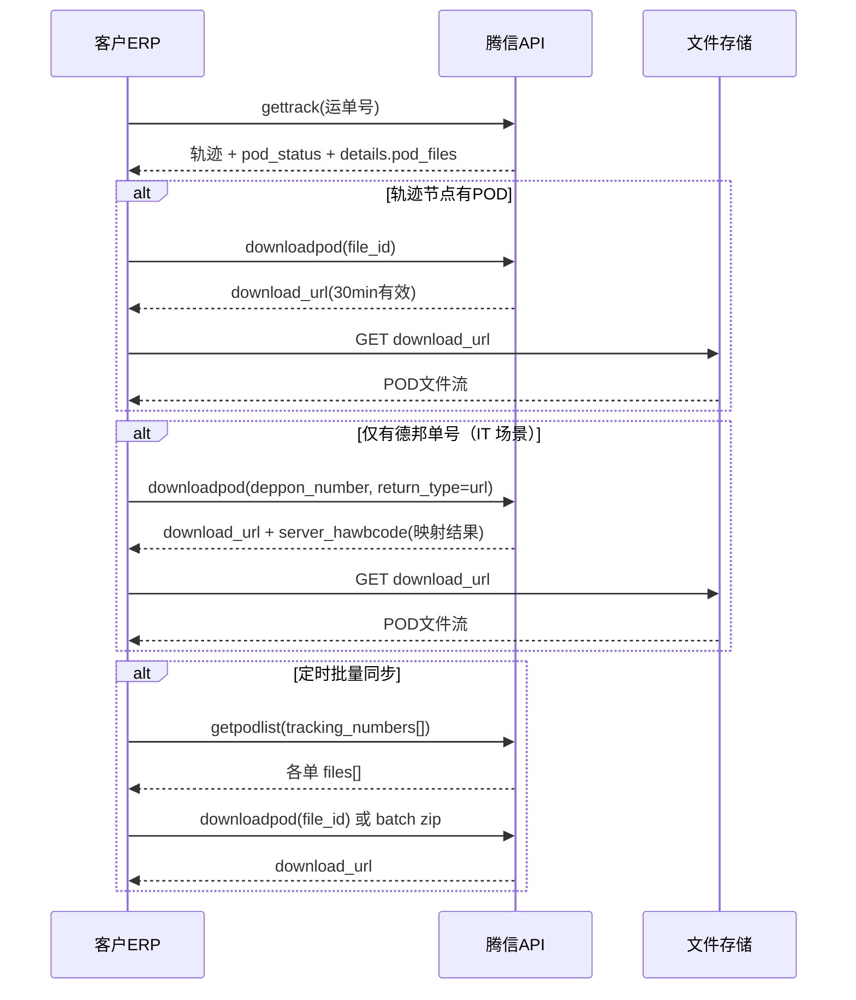

# 腾信国际客户 API · POD 文件对接调整说明

> 基于现有 **腾信国际客户API对接文档 V1** 中「获取订单跟踪记录」接口扩展。  
> 适用：客户系统拉取 POD（Proof of Delivery / 签收凭证）文件元数据及下载。  
> **2026-07-24 IT 确认**：POD 对外以 **HTTPS 下载 URL** 形式返回；支持使用 **德邦单号**（尾程承运商单号）直接查询对应运单的 POD URL。

---

## IT 答复摘要（客户侧确认）

| 问题 | 答复 |
|------|------|
| 接口回传的 POD 是不是一个 URL？ | **是。** `downloadpod` 默认 `return_type=url`，返回带签名的 `download_url`，有效期 15–30 分钟；客户 GET 该 URL 即可下载文件，**不建议**在接口中直接传永久直链或大段 Base64。 |
| 能否用德邦单号直接获取对应运单的 POD URL？ | **可以。** 在 `getpodlist` / `downloadpod` 中传入 `carrier_code=DEPPON` + `carrier_tracking_number`（或 `deppon_number`），系统按尾程单号映射到腾信运单后返回 POD 元数据或下载 URL。 |
| 是否还要先知道腾信运单号？ | **不强制。** 若客户侧仅有德邦单号，可跳过 `tracking_number`，直接用承运商单号查；若一单多 POD，仍建议先 `getpodlist` 再按 `file_id` 下载指定文件。 |

---

## 一、方案总览

| 能力 | 方式 | 说明 |
|------|------|------|
| 查询是否有 POD | 扩展「获取订单跟踪记录」 | `details` 增加 `pod_files` 字段，轨迹节点展示附件 |
| 拉取 POD 文件列表 | **新增**「获取订单POD附件」 | 按腾信运单号 **或 德邦/尾程承运商单号** 返回全部 POD 元数据 |
| 下载 POD 文件 | **新增**「下载POD文件」 | 返回临时下载 **URL**（默认）或 Base64；**支持德邦单号一键取 URL** |
| 德邦单号查 POD URL | `downloadpod` / `getpodlist` | `carrier_code=DEPPON` + 德邦单号 → 映射运单 → 返回 `download_url` |

**设计原则**
- 跟踪接口只做「有没有、关联哪个轨迹节点」，不直接塞大二进制
- 下载走独立接口，URL 有效期 15–30 分钟，支持鉴权与审计
- 与页面端共用同一套文件存储与权限逻辑

---

## 二、现有接口调整：获取订单跟踪记录

### 2.1 接口信息（不变）

| 项目 | 说明 |
|------|------|
| 接口名称 | 获取订单跟踪记录 |
| 请求方式 | POST |
| 地址 | `https://interface.txfba.com/webservice/PublicService.asmx/ServiceInterfaceUTF8` |
| 方法名 | `gettrack`（以现网为准，下文为示例） |

### 2.2 请求参数（不变）

```json
{
  "appToken": "客户Token",
  "appKey": "客户Key",
  "serviceMethod": "gettrack",
  "paramsJson": {
    "tracking_number": "874601301090",
    "reference_number": "9545451WFA",
    "carrier_code": "DEPPON",
    "carrier_tracking_number": "DPK1234567890123"
  }
}
```

`tracking_number` / `reference_number` / **承运商单号** 至少传一种；仅持有德邦单号时，传 `carrier_code` + `carrier_tracking_number`（或 `deppon_number`）即可。

### 2.3 响应结构调整

在原有 `data[].details[]` 每条轨迹中**新增**以下字段：

| 字段名 | 类型 | 说明 |
|--------|------|------|
| pod_available | int | 该轨迹节点是否有关联 POD：`0` 无，`1` 有 |
| pod_count | int | 该节点关联 POD 文件数，无则为 0 |
| pod_files | array | POD 文件摘要列表（可选返回，见 2.4） |

在 `data[]` 运单层级**新增**：

| 字段名 | 类型 | 说明 |
|--------|------|------|
| pod_status | string | 运单 POD 汇总：`none` 未回传 / `partial` 部分 / `complete` 已回传 |
| pod_total | int | 该运单 POD 文件总数 |
| latest_pod_time | string | 最新 POD 上传时间 `yyyy-MM-dd HH:mm:ss`，无则 null |
| signatory_name | string | 签收人（原有字段，POD 回传后填充） |
| carrier_code | string | 尾程承运商代码，如 `DEPPON`（德邦） |
| carrier_tracking_number | string | 尾程承运商单号，如德邦运单号 |
| pod_download_url | string | **可选**；当 `pod_status=complete` 且仅 1 个 POD 时，可直接返回最新 POD 的临时下载 URL（与 `downloadpod` 一致，30min 有效） |

### 2.4 `pod_files` 元素结构（轨迹节点内，轻量）

| 字段名 | 类型 | 说明 |
|--------|------|------|
| file_id | string | 文件唯一 ID，用于下载接口 |
| file_name | string | 原始文件名，如 `POD_9545451WFA.pdf` |
| file_type | string | 固定 `POD`，预留 `POD_PHOTO` 等 |
| file_size | int | 字节数 |
| upload_time | string | 上传时间 |
| download_token | string | **可选**；若跟踪接口直接给 token，客户可免二次列表调下载（不推荐，建议走 3.2） |

> **推荐**：跟踪接口 `pod_files` 仅返回 `file_id + file_name + upload_time`，完整列表走 3.1；避免跟踪接口 payload 过大。

### 2.5 响应示例（节选）

```json
{
  "success": 1,
  "cnmessage": "获取跟踪记录成功",
  "enmessage": "Get track success",
  "data": [
    {
      "server_hawbcode": "874601301090",
      "reference_hawbcode": "9545451WFA",
      "destination_country": "US",
      "track_status": "CC",
      "track_status_name": "签收",
      "pod_status": "complete",
      "pod_total": 2,
      "latest_pod_time": "2026-07-23 18:18:51",
      "signatory_name": "JOHN DOE",
      "details": [
        {
          "track_occur_date": "2026-07-23 18:18:51",
          "track_location": "LAX",
          "track_description": "已签收，POD已回传",
          "track_code": "DELIVERED",
          "pod_available": 1,
          "pod_count": 2,
          "pod_files": [
            {
              "file_id": "POD202607230001",
              "file_name": "POD_9545451WFA.pdf",
              "file_type": "POD",
              "upload_time": "2026-07-23 18:18:51"
            },
            {
              "file_id": "POD202607230002",
              "file_name": "POD_9545451WFA_photo.jpg",
              "file_type": "POD_PHOTO",
              "upload_time": "2026-07-23 18:19:02"
            }
          ]
        },
        {
          "track_occur_date": "2026-07-23 10:00:00",
          "track_location": "CN",
          "track_description": "国内报关已放行，等待出发",
          "track_code": "CUSTOMS_RELEASED",
          "pod_available": 0,
          "pod_count": 0,
          "pod_files": []
        }
      ]
    }
  ]
}
```

### 2.6 兼容性

- 未升级客户：`pod_available`/`pod_files` 不存在时视为无 POD，不影响原逻辑
- 新增字段均为可选扩展，旧版解析忽略即可

---

## 三、新增接口：获取订单 POD 附件列表

### 3.1 接口基本信息

| 项目 | 说明 |
|------|------|
| 接口名称 | 获取订单POD附件 |
| 请求方式 | POST |
| 地址 | 同上 `ServiceInterfaceUTF8` |
| 方法名 | `getpodlist`（建议，需与现网 serviceMethod 枚举对齐） |

### 3.2 请求参数

```json
{
  "appToken": "客户Token",
  "appKey": "客户Key",
  "serviceMethod": "getpodlist",
  "paramsJson": {
    "tracking_number": "874601301090",
    "reference_number": "9545451WFA",
    "tracking_numbers": ["874601301090", "874601301091"],
    "carrier_code": "DEPPON",
    "carrier_tracking_number": "DPK1234567890123",
    "deppon_number": "DPK1234567890123",
    "carrier_tracking_numbers": ["DPK1234567890123", "DPK1234567890124"],
    "include_download_url": 0
  }
}
```

| 字段 | 类型 | 必填 | 说明 |
|------|------|------|------|
| tracking_number | string | 否* | 腾信服务商单号 |
| reference_number | string | 否* | 原单号/客户参考号 |
| tracking_numbers | array | 否 | 批量查询腾信单号，最多 50 单/次 |
| carrier_code | string | 否* | 尾程承运商代码；德邦固定传 **`DEPPON`** |
| carrier_tracking_number | string | 否* | 尾程承运商单号（**德邦单号**） |
| deppon_number | string | 否* | 德邦单号别名，与 `carrier_tracking_number` 等价；传此项时 `carrier_code` 默认 `DEPPON` |
| carrier_tracking_numbers | array | 否 | 批量德邦/承运商单号，最多 50 个/次；需配合 `carrier_code` |
| include_download_url | int | 否 | `1` 时在 `files[]` 中附带 `download_url`（每文件独立签名 URL）；默认 `0` 仅返回元数据 |

> **查询规则**：`tracking_number` / `reference_number` / `carrier_tracking_number`（或 `deppon_number`）**至少传一种**。客户 IT 场景：仅有德邦单号时，传 `deppon_number` 或 `carrier_code=DEPPON` + `carrier_tracking_number`。

### 3.3 响应参数

```json
{
  "success": 1,
  "cnmessage": "获取POD列表成功",
  "data": [
    {
      "server_hawbcode": "874601301090",
      "reference_hawbcode": "9545451WFA",
      "carrier_code": "DEPPON",
      "carrier_tracking_number": "DPK1234567890123",
      "pod_status": "complete",
      "signatory_name": "JOHN DOE",
      "sign_time": "2026-07-23 18:18:51",
      "files": [
        {
          "file_id": "POD202607230001",
          "file_name": "POD_9545451WFA.pdf",
          "file_type": "POD",
          "file_ext": "pdf",
          "file_size": 245760,
          "upload_time": "2026-07-23 18:18:51",
          "track_code": "DELIVERED",
          "downloadable": 1,
          "download_url": "https://download.txfba.com/pod/signed/xxx?expires=1730000000"
        }
      ]
    }
  ]
}
```

| 字段 | 说明 |
|------|------|
| pod_status | `none` / `partial` / `complete` |
| downloadable | `1` 可下载；`0` 无权限或文件归档中 |
| download_url | 当 `include_download_url=1` 且 `downloadable=1` 时返回；**HTTPS 临时 URL**，有效期见 `expires_in` |
| files | 该运单全部 POD，不限轨迹节点 |

---

## 四、新增接口：下载 POD 文件

### 4.1 接口基本信息

| 项目 | 说明 |
|------|------|
| 接口名称 | 下载POD文件 |
| 请求方式 | POST |
| 方法名 | `downloadpod` |

### 4.2 请求参数

**方式 A：按 file_id 下载（推荐）**

```json
{
  "appToken": "客户Token",
  "appKey": "客户Key",
  "serviceMethod": "downloadpod",
  "paramsJson": {
    "file_id": "POD202607230001",
    "tracking_number": "874601301090"
  }
}
```

**方式 B：按运单批量打包**

```json
{
  "serviceMethod": "downloadpod",
  "paramsJson": {
    "tracking_numbers": ["874601301090", "874601301091"],
    "pack_format": "zip"
  }
}
```

**方式 C：按德邦单号直接获取 POD URL（IT 推荐 · 一键）**

客户侧仅有德邦单号、且每票通常 1 份 POD 时，可**一次调用**拿到 `download_url`，无需先查腾信运单号。

```json
{
  "appToken": "客户Token",
  "appKey": "客户Key",
  "serviceMethod": "downloadpod",
  "paramsJson": {
    "carrier_code": "DEPPON",
    "carrier_tracking_number": "DPK1234567890123",
    "return_type": "url"
  }
}
```

或使用德邦专用字段（等价）：

```json
{
  "serviceMethod": "downloadpod",
  "paramsJson": {
    "deppon_number": "DPK1234567890123",
    "return_type": "url"
  }
}
```

| 场景 | 行为 |
|------|------|
| 德邦单号已绑定 1 个 POD | 直接返回该文件 `download_url` |
| 德邦单号已绑定多个 POD | 返回 `success=1` 且 `data.files[]` 列表，每项含独立 `download_url`；或传 `file_id` 指定下载 |
| 德邦单号未绑定运单 / 无 POD | 见 4.4 错误码 |

| 字段 | 类型 | 必填 | 说明 |
|------|------|------|------|
| file_id | string | 否* | 单文件下载 |
| tracking_number | string | 否* | 腾信运单号；校验 file 归属 |
| tracking_numbers | array | 否* | 批量打包腾信单号，与 file_id 互斥 |
| carrier_code | string | 否* | 尾程承运商代码；德邦传 **`DEPPON`** |
| carrier_tracking_number | string | 否* | 尾程承运商单号（**德邦单号**） |
| deppon_number | string | 否* | 德邦单号别名；与 `carrier_tracking_number` 等价 |
| carrier_tracking_numbers | array | 否* | 批量德邦单号打包 zip |
| pack_format | string | 否 | 批量时固定 `zip` |
| return_type | string | 否 | **`url`（默认，IT 确认采用）** 或 `base64` |

> **参数组合**：`file_id` / `tracking_number(s)` / `carrier_tracking_number`（或 `deppon_number`）至少一种；德邦场景优先用方式 C。

### 4.3 响应参数

**return_type = url（默认 · IT 确认）**

```json
{
  "success": 1,
  "cnmessage": "成功",
  "data": {
    "server_hawbcode": "874601301090",
    "reference_hawbcode": "9545451WFA",
    "carrier_code": "DEPPON",
    "carrier_tracking_number": "DPK1234567890123",
    "file_id": "POD202607230001",
    "file_name": "POD_9545451WFA.pdf",
    "download_url": "https://download.txfba.com/pod/signed/xxx?expires=1730000000",
    "expires_in": 1800,
    "content_type": "application/pdf",
    "file_size": 245760
  }
}
```

> **说明**：`download_url` 为 **POD 文件的 HTTPS 临时下载地址**，非永久 OSS 直链；过期后需重新调用 `downloadpod` 获取新 URL。

**return_type = base64（小文件备用）**

```json
{
  "success": 1,
  "data": {
    "file_id": "POD202607230001",
    "file_name": "POD_9545451WFA.pdf",
    "content_type": "application/pdf",
    "file_base64": "JVBERi0xLjQK..."
  }
}
```

**批量 zip**

```json
{
  "success": 1,
  "data": {
    "pack_name": "POD_batch_20260724.zip",
    "download_url": "https://download.txfba.com/pod/batch/xxx.zip",
    "expires_in": 1800,
    "file_count": 5
  }
}
```

### 4.4 错误码（建议）

| success | cnmessage | 说明 |
|---------|-----------|------|
| 0 | 运单不存在 | 腾信单号无效或非本客户数据 |
| 0 | 承运商单号未绑定运单 | 德邦单号在系统中无映射 |
| 0 | POD未回传 | pod_status=none |
| 0 | 文件不存在或已过期 | file_id 无效 |
| 0 | 无下载权限 | 客户 API 权限未开通 POD |
| 0 | 批量超过上限 | 单次 >50 单 |

---

## 五、客户对接推荐流程



1. **日常**：轮询 `gettrack`，发现 `pod_status=complete` 或 `details[].pod_available=1` 后拉取
2. **德邦单号**：客户 ERP 持有德邦单号时，直接 `downloadpod(deppon_number)` 取 `download_url`；或 `getpodlist(deppon_number, include_download_url=1)` 批量带 URL
3. **批量**：日终用 `getpodlist` + `downloadpod(pack_format=zip)` 对齐页面「批量下载POD」
4. **存储**：客户侧按 `file_id` 去重落库，避免重复下载；**勿将 `download_url` 当作永久地址落库**

---

## 六、与页面端对齐

| 页面能力 | 对应 API |
|----------|----------|
| 列表列「POD状态」 | `gettrack.data[].pod_status` 或列表专用字段 |
| 列表「下载」图标 | `downloadpod(file_id)` |
| 工具栏「批量下载POD」 | `downloadpod(tracking_numbers[], pack_format=zip)` |
| 轨迹弹窗节点右侧下载 | `details[].pod_files` → `downloadpod` |
| 附件信息 Tab | 同 `getpodlist` 返回的 `files` |

---

## 七、权限与安全

1. **API 权限项**：客户后台勾选「POD 查询」「POD 下载」，与现有 Token 绑定
2. **数据隔离**：仅能下载本客户账号下运单的 POD
3. **下载 URL**：HTTPS + 签名 + 过期时间；禁止永久直链
4. **审计日志**：记录 appKey、运单号、file_id、IP、时间
5. **自提/无需 POD**：`pod_status=none` 且业务标记自提时，接口返回明确说明而非错误

---

## 八、实施分期

| 阶段 | 内容 |
|------|------|
| P0 | 页面列表 POD 列 + 单条下载；`getpodlist` + `downloadpod(url)`；**德邦单号查 POD URL** |
| P1 | 轨迹节点 POD 下载；扩展 `gettrack` 的 pod 字段；`getpodlist.include_download_url` |
| P2 | 批量 zip 下载；`gettrack` 批量；Base64 兜底 |

---

## 九、待确认项（调研）

1. POD 文件来源：海外仓回传 / 承运商抓取 / 客服上传？
2. 一单多 POD（多段派送）是否按轨迹节点挂载？
3. 现网 `serviceMethod` 枚举命名规范（getpodlist / downloadpod 是否可用）
4. 批量上限：50 单/次是否满足客户 ERP 场景
5. ~~德邦单号映射规则~~ → **已确认**：支持 `deppon_number` / `carrier_code=DEPPON` 查询；POD 对外返回 **临时 download_url**
