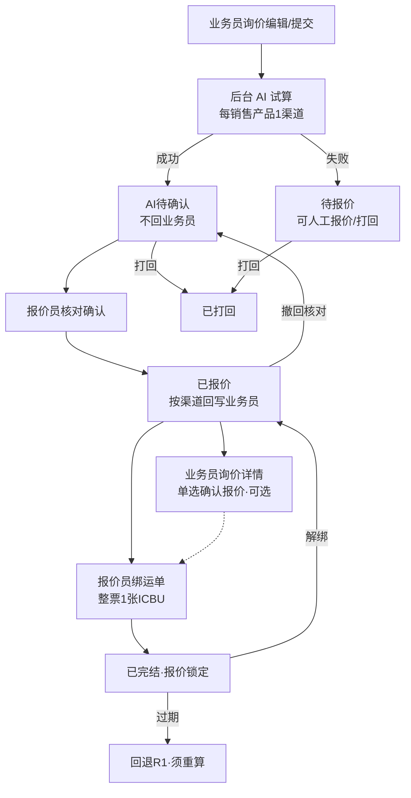

# 散货 AI 询价报价 — 需求迭代文档

> 版本：2026-08-24  
> 范围：**仅散货（LCL）AI 询价报价闭环**；整柜（FCL）保留列表/详情导航，**不扩 AI 算价**  
> 依据：现网代码（`BussInquiry` / `BussQuotation`）+ 报价组原型 / [需求 PRD](https://271935452-lab.github.io/-/%E4%BA%A7%E5%93%81%E9%83%A8%E9%97%A8/%E6%8A%A5%E4%BB%B7%E7%BB%84/%E6%95%A3%E8%B4%A7AI%E8%AF%A2%E4%BB%B7%E6%8A%A5%E4%BB%B7-%E9%9C%80%E6%B1%82PRD.html) + [组流程图](https://271935452-lab.github.io/-/%E4%BA%A7%E5%93%81%E9%83%A8%E9%97%A8/%E6%8A%A5%E4%BB%B7%E7%BB%84/G1-%E7%A7%81%E5%8D%A1%E6%8A%A5%E4%BB%B7-%E7%BB%84%E6%B5%81%E7%A8%8B%E5%9B%BE.html)

---

## 一、背景与目标

### 1.1 痛点（现网）

| 痛点 | 现网表现 |
|---|---|
| 算价口径分散 | 内州 713、外州万物智联、仓绑定、头程运价无统一配置与版本 |
| AI 与业务员边界不清 | 提交后 AI 写 `S_BUSS_QUOTATION(type=0)`，列表可合成「AI已报价」，业务员可能过早见价 |
| 多渠道回写不统一 | 一单多销售产品时，单价 / 有效期 / 尾程 / 备注粒度不清晰 |
| 过期价可被使用 | 有效期卡控弱；绑单规则与 To-Be A/B 校验不一致 |
| 绑单风险 | 现网按重量误差百分比软匹配；缺少结构化初筛表与港后客服通知 |

### 1.2 本期目标

1. **AI 试算 + 报价员核对门控**：`AI待确认` 不回业务员；核对确认后按**渠道**回写；支持打回、撤回核对（已核对不可 AI 重算）。
2. **AI 报价规则配置**：内州 / 外州 / 仓绑定 / 有效期（锁定）/ 版本发布；试算结果日志可追溯。
3. **有效期规则**：默认 7 天含当日 + 遇 15/30 截断；过期禁绑，须重算再生效。
4. **绑运单闭环**：初筛 + A/B（软提示）；整票单绑 1 张 ICBU；改绑/解绑必通知港后客服；财务锁账/成本已审核后禁止改绑与撤回。
5. **业务员无感知 AI**：仅在询价详情见已核对多渠道价并**单选确认**；列表页本期不改版。

### 1.3 明确不做

- 整柜 AI 算价、整柜绑运单本期范围外  
- 报价时效 KPI 看板  
- 业务员「我的询价」列表 UI 改版（沿用现网）

---

## 二、原型与文档索引

| 页面 / 文档 | 链接 | 角色 |
|---|---|---|
| 需求 PRD（口径主文档） | [散货AI询价报价-需求PRD](https://271935452-lab.github.io/-/%E4%BA%A7%E5%93%81%E9%83%A8%E9%97%A8/%E6%8A%A5%E4%BB%B7%E7%BB%84/%E6%95%A3%E8%B4%A7AI%E8%AF%A2%E4%BB%B7%E6%8A%A5%E4%BB%B7-%E9%9C%80%E6%B1%82PRD.html) | 全员 |
| 组流程图 | [G1-私卡报价-组流程图](https://271935452-lab.github.io/-/%E4%BA%A7%E5%93%81%E9%83%A8%E9%97%A8/%E6%8A%A5%E4%BB%B7%E7%BB%84/G1-%E7%A7%81%E5%8D%A1%E6%8A%A5%E4%BB%B7-%E7%BB%84%E6%B5%81%E7%A8%8B%E5%9B%BE.html) | 全员 |
| 我的询价列表 | [ESS我的报价-列表-MVP](https://271935452-lab.github.io/-/%E4%BA%A7%E5%93%81%E9%83%A8%E9%97%A8/%E6%8A%A5%E4%BB%B7%E7%BB%84/ESS%E6%88%91%E7%9A%84%E6%8A%A5%E4%BB%B7-%E5%88%97%E8%A1%A8-MVP.html) | 业务员 |
| 询价编辑 | [ESS询价编辑-MVP](https://271935452-lab.github.io/-/%E4%BA%A7%E5%93%81%E9%83%A8%E9%97%A8/%E6%8A%A5%E4%BB%B7%E7%BB%84/ESS%E8%AF%A2%E4%BB%B7%E7%BC%96%E8%BE%91-MVP.html) | 业务员 |
| 询价详情（确认报价） | [ESS散货询价详情-MVP](https://271935452-lab.github.io/-/%E4%BA%A7%E5%93%81%E9%83%A8%E9%97%A8/%E6%8A%A5%E4%BB%B7%E7%BB%84/ESS%E6%95%A3%E8%B4%A7%E8%AF%A2%E4%BB%B7%E8%AF%A6%E6%83%85-MVP.html) | 业务员 |
| 报价员列表 | [询价报价-报价员列表-MVP](https://271935452-lab.github.io/-/%E4%BA%A7%E5%93%81%E9%83%A8%E9%97%A8/%E6%8A%A5%E4%BB%B7%E7%BB%84/ESS%E8%AF%A2%E4%BB%B7%E6%8A%A5%E4%BB%B7-%E6%8A%A5%E4%BB%B7%E5%91%98%E5%88%97%E8%A1%A8-MVP.html) | 报价员 |
| 报价员详情 | [散货询价方案详情-MVP](https://271935452-lab.github.io/-/%E4%BA%A7%E5%93%81%E9%83%A8%E9%97%A8/%E6%8A%A5%E4%BB%B7%E7%BB%84/ESS%E6%95%A3%E8%B4%A7%E8%AF%A2%E4%BB%B7%E6%96%B9%E6%A1%88%E8%AF%A6%E6%83%85-MVP.html#view) | 报价员 |
| AI 规则配置 | [AI报价规则配置-优化版](https://271935452-lab.github.io/-/%E4%BA%A7%E5%93%81%E9%83%A8%E9%97%A8/%E6%8A%A5%E4%BB%B7%E7%BB%84/%E7%A7%81%E5%8D%A1%E6%8A%A5%E4%BB%B7-AI%E6%8A%A5%E4%BB%B7%E8%A7%84%E5%88%99%E9%85%8D%E7%BD%AE-%E4%BC%98%E5%8C%96%E7%89%88-MVP.html) | 规则管理员 |
| 通知列表 | [报价组-通知列表-MVP](https://271935452-lab.github.io/-/%E4%BA%A7%E5%93%81%E9%83%A8%E9%97%A8/%E6%8A%A5%E4%BB%B7%E7%BB%84/%E6%8A%A5%E4%BB%B7%E7%BB%84-%E9%80%9A%E7%9F%A5%E5%88%97%E8%A1%A8-MVP.html) | 全员 |

**约定**：原型只展示 UI；字段取值、回写、验收以 PRD / 本文为准。

---

## 三、现网 As-Is 摘要（tx-oms）

### 3.1 入口

| 语义 | 路径 | 过滤 |
|---|---|---|
| 我的询价 | `/bussInquiry/*` | 数据权限（创建人/委托业务员等） |
| 询价报价（报价员） | `/bussQuotation/*` | `QUOTER = 当前用户` 且 `STATUS != 0` |

主表：`S_BUSS_INQUIRY` ↔ `S_BUSS_QUOTATION`（`INQUIRY_NO`）  
报价员路由：`S_INQUIRY_SALESMAN_CONFIG` → 写入询价 `QUOTER`

### 3.2 现网状态

**询价 STATUS**：0 草稿 / 1 已提交 / 2 报价中 / 3 已完结 / 4 已打回  

**报价**：`QUOTATION_STATUS` 0 报价中 / 1 已报价；`TYPE` 0 AI / 1 人工；`CONFIRM_QUOTA=已确认` 完结  

列表合成态：待报价 / AI已报价 / 报价中 / 人工已报价 / 已完结

### 3.3 现网主链路

```
业务员保存草稿 → 提交(status=1)
  → 散货 afterCommit：私卡 AI getSalesPriceList 写 type=0 报价
  → 报价员保存方案(status=2) → 提交报价(quotationStatus=1) → 通知询价人
  → 业务员 confirmQuotation → 询价 status=3
  → getBindOrder / saveBindOrder（已完结 + 已确认报价；重量误差 5%/10%）
```

关键代码：`BussInquiryServiceImpl`、`BussQuotationController`、`BussInquiryMapper.xml`（`getPageList` / `getInquiryPageList`）

---

## 四、To-Be 双轨状态机（核心变更）

> 取消报价员侧「AI已报价」；业务员侧不暴露内部态名。

### 4.1 三态对照

| 阶段 | 报价员列表 | 报价员详情大字 | 业务员（我的询价/详情） | 是否回写单价 |
|---|---|---|---|---|
| 提交后、AI 未出账 | **待报价** | 待报价 | 报价中，无单价 | 否 |
| AI 出账待核对 | **AI待确认** | AI待确认 | 报价中，无单价 | **否** |
| 核对确认未绑 | **已报价** | 已报价 | **人工已报价** + 各渠道单价 | **是（按渠道）** |
| 已绑运单 | **已完结** | 已完结 | 人工已报价（已绑） | 单价锁定 |
| 打回 | 已打回 | 已打回 | 已打回 | 撤回已回写价 |

页签：报价员新增 **待绑运单**（已报价 + 有效期内 + 已登记尾程 + 未绑）。

### 4.2 标准流转



### 4.3 关键回退规则

| 动作 | 条件 | 结果 |
|---|---|---|
| 重算 | **仅 AI待确认** | 新试算轮次；仍不回业务员 |
| 已核对后重算 | 已报价/已完结 | **拦截**；须先撤回核对 |
| 撤回核对 | 已报价且未绑（已绑须先解绑） | 回 AI待确认；撤回业务员单价 |
| 财务锁账 / 成本已审核 | 已绑 | 禁止改绑 / 解绑 / 撤回核对 |

---

## 五、分页面需求（相对现网迭代点）

### 5.1 询价编辑（业务员）— 改 / NEW

原型：[询价编辑](https://271935452-lab.github.io/-/%E4%BA%A7%E5%93%81%E9%83%A8%E9%97%A8/%E6%8A%A5%E4%BB%B7%E7%BB%84/ESS%E8%AF%A2%E4%BB%B7%E7%BC%96%E8%BE%91-MVP.html)

| 项 | 标记 | 要求 |
|---|---|---|
| 销售产品 | 改 | **下拉多选**；一产品多仓地址拆多选项；回显「产品 · 仓名」不带门牌 |
| 海外仓 / 距离 | 改 | **页内不展示**；后台按产品绑仓类型→地址测距 |
| 收货邮编/城市/州 | NEW | 必填；可 AI 识别回填；**州须=邮编所在州**，否则拦截 |
| 纽约仓 NY/NJ | 改 | 仓州≠收货州弹窗确认不拦截；按收货州匹配一口价/距离档 |
| 收货地址参数 | NEW | UI 三选一；落库三字段：`isResidential` / `hasLoadingDock` / `needLiftGate`；传万物智联时再推导 locationType/appoint，**禁止只存合并枚举** |
| 计费重 / 体积 / 重量 | 现网+ | 散货计费重仍后台算；提交触发 AI |

车型锁：住宅或无卸货台 → 仅 26 尺；有卸货台 → 可 53 尺。

### 5.2 我的询价列表 — 现网

原型：[我的询价列表](https://271935452-lab.github.io/-/%E4%BA%A7%E5%93%81%E9%83%A8%E9%97%A8/%E6%8A%A5%E4%BB%B7%E7%BB%84/ESS%E6%88%91%E7%9A%84%E6%8A%A5%E4%BB%B7-%E5%88%97%E8%A1%A8-MVP.html)

- **本期列表 UI 不改**；接口 `/bussInquiry/getPage` 等沿用。  
- 展示规则由报价侧驱动：AI待确认期间仍「报价中」无单价；核对后报价状态=**人工已报价**，详情按渠道见价。  
- 收到报价 / 打回：角标 + 右下角弹窗 + [通知列表](https://271935452-lab.github.io/-/%E4%BA%A7%E5%93%81%E9%83%A8%E9%97%A8/%E6%8A%A5%E4%BB%B7%E7%BB%84/%E6%8A%A5%E4%BB%B7%E7%BB%84-%E9%80%9A%E7%9F%A5%E5%88%97%E8%A1%A8-MVP.html)。

### 5.3 询价详情（业务员）— NEW 拆页

原型：[散货询价详情](https://271935452-lab.github.io/-/%E4%BA%A7%E5%93%81%E9%83%A8%E9%97%A8/%E6%8A%A5%E4%BB%B7%E7%BB%84/ESS%E6%95%A3%E8%B4%A7%E8%AF%A2%E4%BB%B7%E8%AF%A6%E6%83%85-MVP.html)

| 可做 | 不可做 |
|---|---|
| 查看已回传渠道价；多渠道**单选 1 条**；「确认报价」 | 编辑单价/尾程、核对、试算日志、绑定运单 |

确认报价：只记**确认渠道 ID**（可选步骤，不阻塞报价员绑单）。

### 5.4 报价员列表 — 改 / NEW

原型：[报价员列表](https://271935452-lab.github.io/-/%E4%BA%A7%E5%93%81%E9%83%A8%E9%97%A8/%E6%8A%A5%E4%BB%B7%E7%BB%84/ESS%E8%AF%A2%E4%BB%B7%E6%8A%A5%E4%BB%B7-%E6%8A%A5%E4%BB%B7%E5%91%98%E5%88%97%E8%A1%A8-MVP.html)

| 项 | 要求 |
|---|---|
| 状态 Tab | 全部 / 待报价 / **AI待确认** / 已打回 / 报价中 / **待绑运单** / 已报价·已完结 |
| 列 | 新增**更新时间**；单价 / 有效期 / 尾程 / 绑定运单列 |
| 行操作 | 见下表；核对进**详情**，列表不再另开核对弹窗 |
| 试算日志 | **有试算（含失败）才出现**；未试算不展示 |

| 列表状态 | 行上按钮 |
|---|---|
| 待报价 | 报价、打回（+试算日志若曾试算） |
| AI待确认 | 核对确认、打回、试算日志 |
| 已报价 | 绑定运单、试算日志 |
| 已完结 | 改绑运单、试算日志（锁账/已审核则置灰） |

### 5.5 报价员详情 — NEW 主战场

原型：[报价员详情](https://271935452-lab.github.io/-/%E4%BA%A7%E5%93%81%E9%83%A8%E9%97%A8/%E6%8A%A5%E4%BB%B7%E7%BB%84/ESS%E6%95%A3%E8%B4%A7%E8%AF%A2%E4%BB%B7%E6%96%B9%E6%A1%88%E8%AF%A6%E6%83%85-MVP.html#view)

- 左：待核对 / 待绑运单  
- 中：每销售产品 1 卡（仓 · 内外州 · 车型 · **距离**；单价 / 尾程 / 有效期可改；不展示头程、计费重、8 品牌）  
- 右：大字状态 + 时间轴  

核对确认回写（**每渠道各 1 条**）：单价(个位 USD/KG)、有效期从/至、尾程派送费(取整)、核对备注、改价原因(改价时)。

单价公式：

```
给业务员单价 = 头程单价(H1) + 尾端派送费 ÷ 询价计费重   → 取个位 USD/KG
```

### 5.6 绑运单 — 改（相对现网 getBindOrder）

| 维度 | 现网 | To-Be |
|---|---|---|
| 前提 | 询价已完结 + 已确认报价 | **报价员侧已报价**即可绑；业务员确认可选 |
| 初筛 | 客户/邮编/产品/创建人/仓 | 目的国+邮编+交货仓+客户+跟进人(业务员或客服=询价员) |
| 重量 | &lt;500 ≤5%；≥500 ≤10% | **推荐差异 0%**；不符软提示，**不硬挡** |
| 有效期 | 入仓落在有效期内 | 同左为软提示；**过期硬禁绑** |
| 绑定数 | 写 `BILL_NO` | 整票 **1 张 ICBU**；尾程挂接挂费渠道金额 |
| 渠道 | — | 已确认→只读 1 渠道；未确认→报价员选挂费渠道(默认本票最优) |
| 改绑/解绑 | 弱 | 必通知港后客服（改绑旧/新各 1 条）；锁账/已审核禁止 |

### 5.7 AI 报价规则 — NEW 独立菜单

原型：[AI规则优化版](https://271935452-lab.github.io/-/%E4%BA%A7%E5%93%81%E9%83%A8%E9%97%A8/%E6%8A%A5%E4%BB%B7%E7%BB%84/%E7%A7%81%E5%8D%A1%E6%8A%A5%E4%BB%B7-AI%E6%8A%A5%E4%BB%B7%E8%A7%84%E5%88%99%E9%85%8D%E7%BD%AE-%E4%BC%98%E5%8C%96%E7%89%88-MVP.html)

- 入口：运单模块「AI报价规则」，与报价员列表并列；业务员不可见  
- 布局：左分区（内州/外州/仓绑定/有效期/版本）+ 右试算坞（仓绑定隐藏试算坞）  
- 流程：**保存草稿 → 填生效时间发布 → 到点切新版**；在期票不强制改价  
- 可改：六仓价表、迈数/拆车、外州单迈价、品牌启用、销售产品↔海外仓地址  
- 锁定：手切内外州、有效期 7 天+15/30、尾端费公式、万物智联附加费本地叠加  

有效期：散货起算点 = **核对确认时刻**；含当日 7 天；窗口含 15/30 则截断；确认台可改单票有效期（PRD 报价员详情口径）/ 规则页本身锁定默认规则。

### 5.8 试算结果日志 — NEW

- 仅报价员；Modal；每轮 AI 任务结束（成功/失败）落库一轮  
- 每销售产品 1 卡：仓址、测距、匹配步骤、尾程+单价  
- 多轮可切换；核对/改价/绑单**不**产生新轮次  
- 入口：有试算才显示

### 5.9 通知 — 扩类型

类型至少覆盖：收到报价、打回询价、绑定运单、解除绑定、改绑·原单解除、改绑·新单挂接、新询价待报价、报价即将过期。  
与代办弹窗同源；对齐现网 `InquiryNotifyService` / 站内消息，扩展港后客服改绑通知。

---

## 六、算价引擎（询价与规则试算共用）

1. 销售产品 → 海外仓邮编  
2. 仓邮编 + 收货邮编 → 距离（迈）；询价页不展示  
3. ≤ 内州上限迈（默认 150）→ 713 内州；超出 → 外州（同州超上限亦外州）  
4. 纽约仓：内州范围内再按**收货州**选 NY 一口价 / NJ 距离档  
5. 地址锁车型 → 拆车 → 锁尾端派送费 → 合并头程得业务员单价  

外州 26 尺：万物智联优先 8 品牌各取最低；无则补其他最低；**返回价已含附加费，ESS 不二次叠加**。  
内州 / 外州 53 尺不走万物智联。

---

## 七、主数据与组间交接

| 依赖 | 说明 |
|---|---|
| 销售产品 | 绑**海外仓类型**（一产品一类型）；询价多选 |
| 海外仓地址 | 挂在仓类型下可多条；测距用仓邮编，不用国内交货仓 |
| 国内交货仓 | 询价必填；绑单初筛字段 |
| 船务 H1 | 头程运价 → 头程单价；业务员不可见拆分 |
| 万物智联 | `createQuote`；附加费以平台为准 |
| 下游 | 绑单挂尾程 → 海外；报完价 → 船务订舱 |

---

## 八、与现网代码差距（开发拆解建议）

| 模块 | 现网 | 本期需做 |
|---|---|---|
| 提交后 AI | `setQuotePrice` → 旧私卡价表写 type=0 | 换 713+万物智联引擎；状态进 **AI待确认** 且**不回写业务员可见单价** |
| 报价状态语义 | AI已报价 / 人工已报价混用 | 报价员：AI待确认→已报价→已完结；业务员仍用人工已报价 |
| 核对确认 | `submitQuotation` 即推业务员 | 独立「核对确认」门控 + 按渠道回写字段 |
| 业务员确认 | `confirmQuotation` → status=3 | 改为「确认渠道」；**完结改为绑单成功** |
| 绑运单 | 业务员侧 getBindOrder；5%/10% | 报价员侧弹窗；A/B 软提示；整票单绑；港后客服通知 |
| 规则配置 | 无独立菜单 | 新模块：草稿/发布/版本/试算坞 |
| 试算日志 | 无 | 新表/新接口，多轮快照 |
| 询价编辑字段 | 缺收货州/城市/地址三字段 | 扩 `S_BUSS_INQUIRY` + 校验 |
| 有效期 | 手填起止 | 规则默认写入 + 15/30 截断 + 过期禁绑 |

建议迭代切片：

1. **P0** 状态机 + 核对门控 + 业务员无感 AI（不破坏现网列表）  
2. **P1** 询价字段 + 713/万物智联算价 + 试算日志  
3. **P2** 报价员绑单/改绑/解绑 + 通知  
4. **P3** AI 规则配置（草稿发布版本）+ 有效期卡控  

---

## 九、验收要点（摘录）

1. 业务员提交后至核对前：询价详情**无单价**；报价员为 AI待确认。  
2. 核对确认后：业务员见 N 渠道单价；报价状态=人工已报价；报价员=已报价。  
3. 已核对不可 AI 重算；撤回后才可再编辑/核对。  
4. 绑单：未选运单/过期/未登记尾程/未选挂费渠道 → 硬拦；初筛/A/B 不符 → 提示可绑。  
5. 改绑必发港后客服 2 条（旧解除 + 新挂接）；同人亦不合并。  
6. 锁账或成本已审核：改绑/解绑/撤回均不可用。  
7. 规则页改价仅草稿；到点后新询价走新版；在期票不强制作废。  
8. 地址参数落库三字段，禁止单枚举码；万物智联不本地叠附加费。

---

## 十、涉及现网文件（对照用）

| 路径 | 说明 |
|---|---|
| `tx-oms/.../tail/controller/BussInquiryController.java` | 我的询价 |
| `tx-oms/.../tail/controller/BussQuotationController.java` | 报价员 |
| `tx-oms/.../tail/service/impl/BussInquiryServiceImpl.java` | 提交、AI、绑单匹配 |
| `tx-oms/.../tail/service/impl/BussQuotationServiceImpl.java` | 保存报价 |
| `tx-oms/.../tail/mapper/BussInquiryMapper.xml` | 列表权限与状态 |
| `tx-oms/.../tail/service/impl/InquiryNotifyServiceImpl.java` | 报价/打回通知 |
| `docs/询价功能优化/设计文档.md` | 报价员匹配配置 |
| `docs/getBindOrder业务匹配/getBindOrder业务匹配规则说明.md` | 现网绑单规则 |

---

## 十一、变更标记说明

| 标记 | 含义 |
|---|---|
| NEW | 本期新增能力/字段 |
| 改 | 相对现网流程改动 |
| 现网 | 本期不改 UI，仅归档口径 |
| 待定 | 不可作验收口径 |

---

**文档维护**：报价组 · 存放于 `docs/询价功能优化/` · 与 [需求 PRD](https://271935452-lab.github.io/-/%E4%BA%A7%E5%93%81%E9%83%A8%E9%97%A8/%E6%8A%A5%E4%BB%B7%E7%BB%84/%E6%95%A3%E8%B4%A7AI%E8%AF%A2%E4%BB%B7%E6%8A%A5%E4%BB%B7-%E9%9C%80%E6%B1%82PRD.html) 冲突时以 PRD 最新版为准，本文侧重「现网差距 + 迭代切片」。
