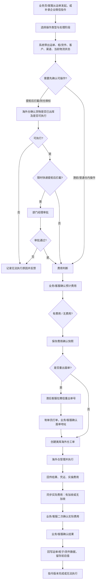

# 海外仓操作指令：重出、拦截、换标及仓内操作流程

> 文档状态：需求草稿，可进入业务评审；尚不能直接进入真实接口联调。  
> 主要读者：业务员、客服、港前客服、港后客服、海外仓对接组、产品、研发、测试。  
> 依据：业务补充的重出、拦截、换标、拍照/换箱/测量/打托/清点/销毁/撕标操作流程。  
> 原则：企业微信是接收渠道之一，业务员/客服也必须能从运单直接发起；海外仓完成操作不等于系统完成结案，结果必须回写并由业务/客服确认。

## 1. 本次要解决的问题

[已确认] 现在的指令分散在企业微信、海外跟踪表、腾信系统、美库系统和线下表格中。每次拦截、换标、重出、拍照等动作都可能有费用、地址/面单确认、海外仓操作和后续反复变更，容易遗漏或覆盖前一次记录。

本期统一成“一个运单入口、一个母工单、多个指令版本、两套外部动作”的方式：

- 运单详情发起或接收企业微信指令后补录；
- 需要重出面单的，港后客服在**腾信系统**重出单号，再由制单员打单；
- 需要海外仓执行的，在**美库系统**创建海外仓工单；
- 每次后续新指令新增版本，不覆盖前一次已确认、已发送或已执行的指令；
- 每个指令版本都必须完成一次“预计费用确认”；结果可为“有费用已确认”或“无费用已确认”，两者都要保留确认记录；
- 费用分“预计费用确认”和“实际追加费用二次确认”两段保存；
- 海外仓反馈后，业务/客服确认结果并回写运单/柜子相关字段，再结案。

## 2. 统一流程与对象

### 2.1 统一主流程

说明：同一票货如果后续又收到拦截、改地址、换标等新要求，母工单不直接覆盖旧记录，而是创建 `指令版本 V2/V3…`，重新走必要的费用、可行性和海外仓执行节点。货物最终完结时，母工单才关闭。

### 2.2 系统对象

| 对象 | 用途 | 谁维护 | 关键关系 |
| --- | --- | --- | --- |
| 运单/卡派任务 | 业务入口与当前运输状态 | 业务系统 | 一票可关联一个母工单、多条指令版本 |
| 柜/货件/FBA 货件 | 港前、提柜、拆柜及货物范围 | 业务系统/海外仓回传 | 一个指令可选择整票、部分货件或指定箱/件 |
| 操作母工单 | 记录一票货在完结前的持续协同 | 系统 | 包含多个指令版本、费用和海外仓任务 |
| 操作指令版本 | 每一次有效指令的快照 | 业务员/客服/系统 | 不覆盖历史；关联一个或多个海外仓任务 |
| 预计费用确认 | 每个指令版本执行前的费用确认 | 客服/业务 | 有费用或无费用均必须确认；确认后才可进入下一执行节点 |
| 实际追加费用 | 海外仓实际发生的加收费用 | 海外仓回传/客服确认 | 海外仓须明确回传有加收或无加收；两种结果均要二次确认后才可回写完结 |
| 腾信重出记录 | 重出单号、面单、地址确认 | 港后客服/制单员 | 仅重出货物场景必需 |
| 美库海外仓工单 | 仓内执行任务 | 海外仓/港后客服 | 记录外部工单号、受理/执行/结果 |

### 2.3 费用确认在系统中的体现

**BR-OP-FEE-001 [已确认]**：费用确认不是发起页一个“有/无费用”的下拉选项，而是一条与**指令版本**绑定的独立记录。每新增 V2/V3，都要重新生成并确认，不能沿用 V1 的确认结果。

| 字段 | 说明 | 数据来源/维护方 |
| --- | --- | --- |
| 费用确认单号 | 例如 `FC-V2-xxx`；每个指令版本至少一条预计费用确认记录 | 系统生成 |
| 指令版本 | 关联 V1/V2/V3，防止后续指令覆盖历史费用 | 系统 |
| 费用阶段 | `预计费用` / `实际加收费用` | 系统 |
| 确认结论 | `有费用已确认` / `无费用已确认`；实际费用还可为 `待二次确认` | 业务员/客服 |
| 币种、金额、费用项 | 有费用时必填；无费用金额保存为 0，不生成收费单 | 报价来源/海外仓回传，业务员/客服确认 |
| 报价依据或无费用原因 | 例如报价单号、渠道规则、非美库无收费规则；必填 | 业务员/客服 |
| 确认人、确认时间、附件 | 保存客户/业务确认的可追溯证据 | 系统记录 |

**BR-OP-FEE-002 [已确认]**：发起页的“费用预判”只用于提醒处理人，不能解除后续限制。提交工单后，状态统一进入“待费用确认”；只有详情页的费用确认卡保存成功后，才可推送美库、创建外部执行任务或进入非美库处理。

**BR-OP-FEE-003 [已确认]**：美库“已处理”后，系统必须等待并保存实际费用同步结果（有加收或无加收）。实际费用未由业务/客服二次确认时，`确认结果并回写` 和 `完结` 均不可点击。

**BR-OP-FEE-004 [本期不做]**：一期只保存费用快照、确认记录和回写摘要；不自动生成应收/应付、付款、锁账、核销或财务凭证。

## 3. 运单入口交互

### 3.1 入口位置与可见性

[建议] 在“运单详情”增加 **`海外仓操作`** 按钮；在柜子、FBA 货件、异常页保留“转工单”入口，进入同一个弹窗。企业微信收到指令时，客服可从同一入口点击“补录企业微信指令”，填写来源截图/消息链接。

| 角色 | 可以发起 | 发起后可做 | 不可以做 |
| --- | --- | --- | --- |
| 业务员 | 所有操作类型 | 填写客户指令、确认预计费用、确认面单/结果 | 不直接下海外仓工单、不改外部状态 |
| 客服 | 所有操作类型 | 补录企业微信指令、确认费用、跟进结果 | 不替业务确认客户地址/费用，除非已授权 |
| 港前客服（雪） | 港前留仓、港前拍照、港前换标预处理 | 修改港前计划/海外仓资料、备注跟踪 | 不在提柜后绕过海外仓可行性确认 |
| 港后客服 | 提柜后拦截、重出、仓内操作 | 腾信重出、美库下单、跟进回传 | 不跳过费用确认和经理审批 |
| 制单员 | 仅待打单任务 | 打印面单、上传面单版本 | 不修改地址/渠道/费用 |
| 部门经理 | 限时快递提柜后拦截 | 审批可否继续拦截 | 不代替海外仓确认可执行性 |

### 3.2 发起弹窗字段

| 字段/交互 ID | 字段 | 来源 | 规则 |
| --- | --- | --- | --- |
| UI-OP-001 | 操作类型 | 发起人选择 | 重出货物、快递拦截、私仓拦截、亚马逊货物拦截、换标、拍照、换箱、测量、打托、清点、销毁、撕标 |
| UI-OP-002 | 处理阶段 | 系统预填+人工确认 | 港前、提柜后未出库、已到海外仓、已出库；不能只靠人工描述判断 |
| UI-OP-003 | 处理范围 | 系统带出+人工选择 | 整票、指定货件、指定箱/件；必须有可追溯编号 |
| UI-OP-004 | 操作指令 | 业务员/客服输入 | 操作要求、时限、货物范围、客户诉求；附件可上传截图、标签、地址证明 |
| UI-OP-005 | 渠道与当前状态 | 业务系统 | 显示原渠道（TRUCK/自提/UPS/FEDEX/FBA 等）、运单节点、是否已出库；来源和枚举待确认 |
| UI-OP-006 | 费用预判 | 费用规则/人工报价 | 发起时显示“待确认/预计有费用/预计无费用”；只作预判，不能代替正式费用确认 |
| UI-OP-007 | 新地址/新渠道/面单信息 | 发起人/客户确认 | 仅重出、改址、换渠道必填；必须保留确认人、确认时间和附件 |
| UI-OP-008 | 指令来源 | 业务员/客服 | 运单发起、企业微信补录、异常预警、海外仓回传；企业微信截图只作附件，不替代结构化字段 |

### 3.3 页面按钮与提示

- `保存草稿`：允许缺少费用、附件等非必填信息；不得创建海外仓任务。
- `确认费用`：所有指令版本提交后出现；业务/客服须选择“有费用”或“无费用”，填写确认人、金额（有费用必填）及报价依据/无费用原因，生成不可修改的预计费用快照。
- `确认实际加收费用`：仅美库同步实际费用后出现；业务/客服二次确认后，才可点亮“确认结果并回写”。
- `确认可拦截`：提柜后拦截/到仓换标由海外仓反馈后可点亮。
- `提交经理审批`：仅“限时达快递 + 提柜后 + 需要拦截”出现。
- `腾信重出单号`：仅重出货物且费用确认后出现，港后客服可执行。
- `发起美库工单`：满足费用、可行性、审批、面单确认等前置条件后出现。
- `确认结果并回写`：海外仓反馈回来后由业务/客服执行；失败时显示“回写失败”，不能直接结案。
- `新增后续指令`：母工单未终结时可见，自动创建 V2/V3；历史版本只读。

## 4. 操作流程明细

### 4.1 重出货物：亚马逊卡派改快递 / 卡派偏仓改快递

**适用背景**：[已确认] 货物已到海外仓，需由亚马逊卡派或偏仓货物改为快递渠道。

| 步骤 | 责任人 | 系统动作 | 外部交互/结果 |
| --- | --- | --- | --- |
| 1 | 业务员/客服 | 从运单创建“重出货物”指令，填写新渠道、收件地址、范围与时限 | 指令来源可为企业微信补录 |
| 2 | 业务员/客服 | 确认预计费用，冻结费用快照 | 若费用未确认，禁止继续重出 |
| 3 | 港后客服 | 在腾信系统重出单号，回填重出单号、操作人、时间 | [待确认] 腾信是否有可对接 API；未确认前按人工回填设计 |
| 4 | 制单员 | 接收待打单任务，上传面单文件/版本 | 打单完成不等于地址已确认 |
| 5 | 业务员/客服 | 确认面单地址、收件信息和渠道无误 | 保存确认人、时间、截图/邮件 |
| 6 | 港后客服 | 生成操作指令计划表，锁定当前指令版本 | 表格应由系统生成，避免线下重复录入 |
| 7 | 港后客服 | 在美库系统创建海外仓工单，回填外部工单号 | [待确认] 美库实际 API/人工下单方式 |
| 8 | 海外仓 | 受理、操作、回传执行结果及凭证 | 回传实操数量、异常、面单/POD、实际费用 |
| 9 | 客服/业务 | 如有实际追加费用，发起加收确认；确认执行结果 | 费用与结果分别确认 |
| 10 | 系统/客服 | 回写新运单号、渠道、面单版本、海外仓工单号、执行结果 | 回写成功后该版本完成；母工单等待货物终结或下一指令 |

### 4.2 快递拦截与亚马逊货物拦截

[已确认] 亚马逊货物拦截按快递拦截同一流程处理；在操作类型和渠道上区分，避免统计混在一起。

#### A. 港前拦截

1. 企业微信接收，或从运单直接发起拦截指令。
2. 客服/业务确认是否产生拦截费并确认费用。
3. 在海派跟踪表的**对应柜子备注**中新增“拦截指令版本”记录；不覆盖旧备注。
4. 港前客服将柜子计划/柜子数据字段 **Move Type 改为“留仓”**；已预报柜子再按原流程推送美库修改柜子计划并执行拦截，记录“已发送拦截指令”。
5. 系统状态进入“待提柜后确认结果”，不是“已完成”。
6. 提柜后确认实际是否已成功拦截，反馈客服/业务；如有新指令，新增 V2 继续处理，直至货物终结。

#### B. 提柜后拦截

1. 业务员/客服发起或补录指令，系统读取“已提柜/是否出库/原渠道”。
2. 先向海外仓确认是否仍可拦截；必须保存反馈人、时间、货物出库情况和证据。
3. **限时达快递货物**：海外仓确认可行后，必须上报部门经理审批。原因是提柜后拦截会影响整体交付时效。
4. 可拦截且审批通过后，确认费用，在美库系统下海外仓工单。
5. 海外仓反馈拦截结果，客服/业务确认并回写“拦截成功/未成功、原因、最后货物位置”。
6. 有后续指令则新建版本；无后续指令时由业务节点或人工确认货物已完结后关闭母工单。

### 4.3 私仓拦截

#### A. 港前私仓拦截

[已确认] 私仓港前拦截没有拦截费。

1. 企业微信接收或从运单发起；系统保留指令来源。
2. 港前客服（雪）直接更新柜子计划/柜子数据：将 **Move Type 改为“留仓”**。
3. 在海派跟踪表的**对应柜子备注**中登记“港前私仓留仓已下达”。
4. 提柜后转给对应私仓客服继续跟进后续操作，母工单不提前结案。

#### B. 提柜后私仓拦截

1. 业务员/客服接收指令后，先向海外仓确认货物出库情况。
2. 可拦截时在美库系统下拦截工单；不可拦截时反馈原因并将该指令版本标记“无法执行”。
3. 成功后回传拦截结果，记录货物位置、后续处理人和凭证。
4. 后续新要求继续新增指令版本，直到货物完结。

### 4.4 换标

**港前、货物未到海外仓：**

1. 接收换标指令，确认货物原渠道。
2. 根据原渠道判断是否有拦截费；有费用时走预计费用确认。
3. 港前客服（雪）将柜子计划/柜子数据的 **Move Type 改为“留仓”**，并在海派跟踪表的**对应柜子备注**登记换标/拦截指令；原渠道 TRUCK/自提/UPS/FEDEX/FBA 仍保留为原渠道数据，不直接覆盖。
4. 提柜后由对应客服收集线下操作要求，系统生成操作指令计划表。
5. 客服确认计划无误，确认操作费用后在美库系统下换标工单。
6. 海外仓回传换标结果和照片/标签凭证；业务/客服确认并完成回写。

**货物已到海外仓：**

1. 接收换标指令，判断原渠道费用并确认费用。
2. 先让海外仓确认是否仍可拦截/留仓。
3. 可执行时继续计划表、美库工单、结果回传和费用加收流程。
4. 不可执行时，保存海外仓原因和证据，指令版本结案为“无法执行”。[已确认] 该场景按业务要求结束工单。

### 4.5 拍照、换箱、测量、打托、清点、销毁、撕标

上述操作共用“仓内操作”模板，只在操作要求、费用项、结果字段和凭证类型上不同。

| 阶段 | 系统流程 | 海外仓交互 | 必须回传 |
| --- | --- | --- | --- |
| 港前且货物未到港/未到仓 | 接收指令 → 填操作要求 → 判断原渠道是否有拦截费 → 确认费用 → 港前客服单票备注海外仓资料 | 港前客服以资料备注方式预置操作要求 | 指令已备注、要求内容、备注人/时间 |
| 提柜后但未出库 | 接收指令 → 填操作要求 → 判断费用 → 确认费用 → 创建美库工单 | 海外仓受理、执行、反馈 | 操作结果、实际数量/尺寸/板数/清点差异、照片或销毁凭证、实际费用 |

各操作的额外结果字段：

- 拍照：照片分类、拍摄时间、照片数量。
- 换箱：原箱数/新箱数、破损原因、换箱后尺寸重量。
- 测量：长宽高、单位、测量人、测量时间。
- 打托：托盘数、每托箱数、托盘尺寸、缠膜/加固说明。
- 清点：应收数量、实收数量、差异数量、差异原因、清点表。
- 销毁：销毁范围、批准人、销毁时间、销毁证明。
- 撕标：原标签类型、撕标范围、完成照片。

## 5. 海外仓交互与回写规则

### 5.1 与腾信、美库的边界

| 系统 | 本流程使用场景 | 本系统保存什么 | 当前状态 |
| --- | --- | --- | --- |
| 腾信系统 | 重出货物时重出单号、制单打单 | 原运单号、新运单号、面单版本、打单人、地址确认结果 | [已确认] 业务动作；[待确认] 是否可 API 对接 |
| 美库系统 | 拦截、换标和提柜后仓内操作的海外仓工单 | 外部工单号、受理/执行状态、结果、凭证、实际费用 | [已确认] 业务动作；[待确认] 是否可 API 对接 |
| 海外跟踪表 | 港前备注和持续追踪 | 本系统应保存同等结构化记录，并可导出给跟踪表 | [待确认] 是否需双向同步，现阶段不假设接口存在 |

### 5.2 结果回写

| 操作类型 | 回写对象 | 需要回写的结果 |
| --- | --- | --- |
| 重出货物 | 运单/卡派任务 | 新运单号、新渠道、面单版本、地址确认、外部工单号、执行结果 |
| 快递/亚马逊拦截 | 运单/货件、柜子计划 | 拦截状态、最后货物位置、失败原因、海外仓反馈时间；港前回写柜子数据 `Move Type=留仓`，并写入海派跟踪表对应柜子备注 |
| 私仓拦截 | 运单/柜子计划 | `Move Type=留仓`、出库情况、拦截结果、后续客服；海派跟踪表写入对应柜子备注 |
| 换标 | 货件/标签记录 | 标签版本、换标结果、照片、无法执行原因 |
| 拍照/换箱/测量/打托/清点等 | 货件/仓内作业记录 | 对应的数量、尺寸、托盘、差异、照片、证明文件 |
| 费用 | 费用快照 | 预计费用确认、实际追加费用、确认人、费用版本；一期不生成应收应付或财务凭证 |

**BR-OP-001**：[建议] 所有回写都必须记录“原值、新值、操作人、时间、指令版本、外部任务号”。

**BR-OP-002**：[建议] 回写失败时，海外仓反馈和附件仍保存；状态为“回写失败”，允许重试或人工处理，禁止直接标记已完成。

**BR-OP-003**：[建议] 17TRACK 等外部轨迹只作为证据，不直接覆盖实际提柜、出库、签收业务状态。

## 6. 状态与异常

| 当前状态 | 触发动作 | 下一状态 | 备注 |
| --- | --- | --- | --- |
| 草稿 | 提交指令 | 待费用确认/待可行性确认 | 按场景选择前置顺序 |
| 待费用确认 | 业务/客服确认预计费用 | 待可行性确认/待生成计划 | 有费用和无费用都必须确认；无费用也生成确认快照，记录判断依据 |
| 待可行性确认 | 海外仓反馈可执行 | 待经理审批/待生成计划 | 提柜后拦截、到仓换标使用 |
| 待经理审批 | 经理通过 | 待生成计划 | 仅限时达快递提柜后拦截 |
| 待重出单/待打单 | 港后客服、制单员完成 | 待地址确认 | 仅重出货物 |
| 待生成计划 | 客服确认计划 | 待海外仓受理 | 计划版本与指令版本绑定 |
| 待海外仓受理 | 美库受理 | 海外仓执行中 | 外部工单号必填 |
| 海外仓执行中 | 海外仓反馈“已处理” | 待实际费用确认 | 等待并保存实际费用同步结果；有加收或无加收均须二次确认 |
| 待实际费用确认 | 业务/客服确认实际费用 | 待结果确认 | 未确认时禁止业务结果回写和完结 |
| 待结果确认 | 业务/客服确认并回写 | 指令版本完成 | 回写失败转“回写失败” |
| 指令版本完成 | 新增后续指令 | 新版本草稿 | 母工单保持持续跟进 |
| 无法执行 | 保存原因和证据 | 指令版本结案 | 换标到仓不可拦截时按本版本结案 |
| 母工单持续跟进 | 货物终结且无待办版本 | 母工单已完成 | “货物完结”的业务状态待确认 |

## 7. P0/P1 待确认项

| 编号 | 级别 | 需要确认的问题 | 不确认的影响 | 推荐方案 |
| --- | --- | --- | --- | --- |
| Q-OP-001 | P0 | “港前、提柜后、已到海外仓、已出库、货物完结”分别对应哪个系统状态和数据源？ | 系统无法正确触发可行性、审批、工单或结案 | 用运单节点+海外仓出库状态双判断，不依赖人工描述 |
| Q-OP-002 | P0 | 腾信重出单号与美库下工单是 API、页面跳转还是人工回填？可返回哪些字段？ | 无法定义真实联调、重试和状态回传 | 一期先保留人工回填外部单号和结果，联调后再自动化 |
| Q-OP-003 | P0 | 费用规则来自哪里？哪些渠道有拦截费，谁报价，何人有权代表客户确认？ | 可能错误下单或错误加收费用 | 预计费用与实际追加费用分开；无确认不得下收费工单 |
| Q-OP-004 | P0 | 限时达快递提柜后拦截的“重大事项”、审批人和拒绝口径是什么？ | 审批权限与时效风险不清 | 海外仓确认可行后再提交指定部门经理审批 |
| Q-OP-005 | P1 | 重出后原运单和新运单如何关联，原单何时停止轨迹跟踪？ | 轨迹、费用、客户查询可能断裂 | 保存原/新单关联及生效时间，旧单只读保留 |
| Q-OP-006 | P1 | 海外跟踪表是否需要继续维护、导入导出或双向同步？ | 可能出现两套记录不一致 | 本期系统生成可导出记录；双向同步待确认 |
| Q-OP-007 | P1 | 指令计划表标准模板、制单员/客服/海外仓的签收时效是什么？ | 无法验收自动生成字段和 SLA | 先将计划表生成作为文件/结构化明细，模板由业务提供 |

## 8. 当前就绪度

- 可进入评审：主流程、角色分工、四类操作分支、入口和回写目标已经梳理。
- 前端可做原型：运单入口、操作类型选择、费用确认、可行性/审批、指令版本、海外仓反馈和回写失败状态。
- 后端暂不可真实开发：Q-OP-001 至 Q-OP-004 为 P0，尤其是外部系统真实对接方式和费用规则。
- 测试可先准备模拟用例：港前/提柜后、可拦截/不可拦截、需要/无需费用、经理通过/拒绝、重出地址确认、海外仓返回追加费用、回写失败、新指令版本。
