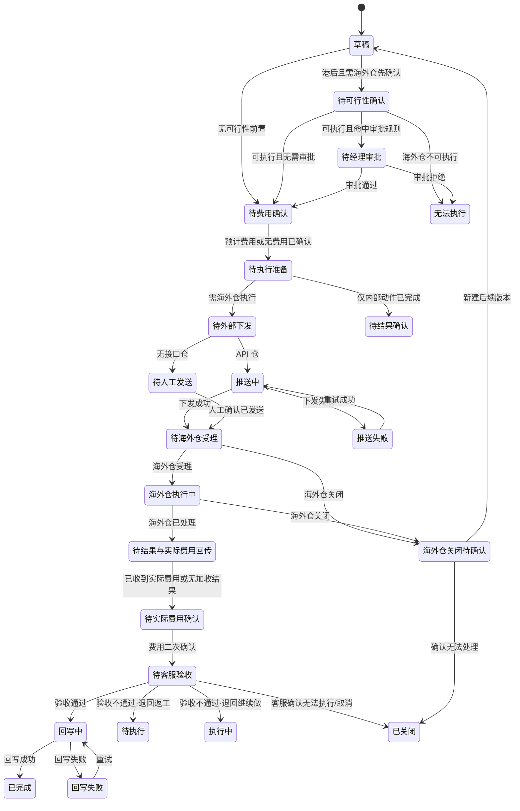

# 统一工单状态流转 PRD

> **文档状态：需求草稿，可进入评审，暂不可直接进入真实接口开发。**  
> 主要读者：业务员、客服、港前/港后客服、海外对接、产品、研发、测试。  
> 版本：0.3｜更新：2026-09-16  
> 依据：`海外异常统一工单-流程与页面原型.html`、`海外仓操作指令流程-系统设计草案.md`及本轮确认的工单配置口径；本版补充「执行—验收」双阶段闭环（BR-STS-007）与母工单完结规则（BR-STS-009）。  
> 角色就绪度：前端【可按草稿设计】；后端【存在 P0】；联调【不可】；测试【可先编写模拟用例】。

## 1. 一句话结论

[已确认] 统一工单由“母工单 + 指令版本”组成。每次拦截、换标、重出或仓内操作均是一个指令版本；客户新要求创建 V2/V3，不能修改已下发或已执行的旧版本。验收不通过的返工退回原执行人，不升版。

[已确认] **母工单完结（BR-STS-009）**：母工单处理中可挂多个子工单（样板：V1 拦截 → V2 拍照 → V3 换标）；**所有子工单完成且无待确认事项后，母工单完结**。不以「货物终结」作为关母单前置。

[已确认] 所有指令版本必须完成费用确认；“无费用”也必须留下确认记录。需要海外仓实际执行、确认能否执行、反馈结果或实际费用时，必须发起统一工单；是否推送美库由海外仓对接能力决定，不决定是否生成工单。

[已确认] **执行—验收双阶段**：执行人只提交结果；客服验收通过后才回写/完结。海外仓拍完照片不代表工单结束。

**BR-STS-000 [已确认]**：费用确认和后续执行不是两张平级业务工单。它们属于同一张母工单的同一个指令版本：费用确认是该版本的内部子任务/独立确认记录；海外仓执行是该版本的执行阶段，并可关联外部美库工单或线下指令。实际加收费用仅新增该版本的第二条费用确认记录，不新建执行工单。

## 2. 范围与边界

### 本期范围

- 重出、快递/亚马逊/私仓拦截、换标，以及拍照、换箱、测量、打托、清点、销毁、撕标等仓内操作。
- 港前/港后路由、费用确认、海外仓可行性确认、经理审批、外部下发、结果/费用回写和后续指令版本。
- 美库 API 仓、其他 API 仓和无接口海外仓的统一状态口径。

### 本期不做

- [本期不做] 自动生成应收/应付、付款、锁账、核销或财务凭证。
- [本期不做] 将海外仓原始状态直接作为本系统主状态。

### 生成工单的边界

| 情况 | 是否生成统一工单 | 说明 |
| --- | --- | --- |
| 海外仓需要实际处理、确认可否处理、回传结果或实际费用 | 是 | 美库/API 仓自动接口下发；无接口仓生成同样的线下操作指令。 |
| 港前要求到仓后执行，如留仓、换标、拍照 | 是 | 创建“预执行”版本，等待仓库执行；不能因货物未到仓而漏记。 |
| 仅内部沟通、费用预判、客户咨询、系统备注或单纯修改内部字段 | 否 | 仅留日志/备注，不创建执行工单。 |
| 已有工单后收到新要求 | 是 | 创建关联 V2/V3，不覆盖旧版本。 |

## 3. 状态模型

### 3.1 四类状态必须分开保存

| 状态维度 | 用途 | 示例 |
| --- | --- | --- |
| 母工单状态 | 反映整票货物的总体协同是否结束 | 草稿、处理中、持续跟进、已完成 |
| 指令版本状态 | 反映 V1/V2 当前走到哪一步 | 待费用确认、海外仓执行中、版本已完成 |
| 外部执行状态 | 反映美库/其他仓的原始或映射状态 | 待人工发送、推送中、已受理、已处理、关闭 |
| 费用与回写状态 | 防止“海外仓已处理”直接变成“已完结” | 预计费用已确认、待实际费用确认、回写失败 |

**边界（已确认）**：一期**没有**「待转业务记录」与转单前阶段。资料不全仅发起页草稿，不进履约工作台。提交即建母工单+指令工单。费用审核、审批均为**状态模板内节点**（顺序由模板决定），不是平行流程。

**BR-STS-001 [已确认]**：外部“已处理”只表示海外仓动作已完成，不等于指令版本完成；仍须接收实际费用、业务/客服**验收**处理结果并完成业务数据回写。拍完照片 ≠ 工单结束。

**BR-STS-002 [已确认]**：外部“关闭”不等于处理成功。系统必须保存关闭原因，指令版本进入“海外仓关闭待确认”，由业务/客服决定新增后续版本或以“无法执行”作为**结果结论**结案（不单独扩失败状态枚举）。

### 3.1.1 执行—验收双阶段闭环（BR-STS-007）[已确认]

统一为：

```
客服/业务发起指令
  → 路由给实际执行岗位或海外仓
  → 执行人提交结果、照片、费用、无法执行原因
  → 客服验收
       ├─ 通过：指令版本完成 / 回写业务数据
       ├─ 不通过：退回原执行人返工（同一指令版本，不新建 V2）
       └─ 无法执行：客服确认原因后<strong>直接关闭当前指令</strong>（不自动生成后续指令）
```

| 规则 | 口径 |
| --- | --- |
| **执行权** | 海外仓、仓库/PDA 操作人只能「提交结果」，**不能**自行完结母工单或指令工单。 |
| **验收权** | 客服是指令下达与结果验收人；**不**承担拍照、测量、换标等一线实际操作。 |
| **返工** | 照片不合规、结果不完整 → 客服退回原执行人重做；**同一指令返工不新建 V2**。结果记录须留存**退回原因、退回次数、附件要求**；状态从「待客服验收」退回「待执行 / 执行中」。**不**新增「执行失败」「照片不合格」等状态。 |
| **升版** | 客户提出新要求（如「先拦截，再换标」）才在同一母工单下新建 V2。 |
| **无法执行** | 作为结果结论，经客服确认后进入**已关闭**；**不**自动生成后续指令；客户另有新要求时人工新建版本。 |

### 3.1.2 核心状态目录 · 验收责任 / 结果结论（BR-STS-008）[已确认]

状态模板结构保持：模板列表 → 所需状态 → 前后流转 → 默认岗位。指令状态目录须明确以下核心节点：

| 节点 | 默认责任岗位 | 说明 |
| --- | --- | --- |
| 待受理 | 客服 / 对应执行池 | 接收后须在首响 SLA 内点击受理 |
| 待执行 | 仓库 / 海外仓 / 国内操作岗位 | 已具备资料和执行条件，等待处理 |
| 执行中 | 实际执行人 | 执行人上传过程或结果 |
| 待客服验收 | 发起客服 / 客服池 | 对照片、数量、操作结果、费用进行确认 |
| 已完成 | 系统 | 验收通过后回写、归档 |
| 已关闭 | 客服 / 系统 | 客服确认无法执行、取消等结论后关闭 |

**待客服验收**为涉及海外仓、仓内操作、拍照、测量、换标、打托等场景的**必经节点**。

### 3.2 母工单状态

| 当前状态 | 触发条件 | 下一状态 | 说明 |
| --- | --- | --- | --- |
| 草稿 | 首次保存草稿 | 处理中 / 已取消 | 草稿未产生海外仓执行任务。 |
| 处理中 | 首个版本提交，或存在任一非终态子工单（指令版本） | 已完成 / 已取消 | 母工单不因某一个子工单完成而结束；全程可挂 V1/V2/V3… |
| 已完成 | **所有子工单完成，且无待确认事项**（BR-STS-009） | — | 终态，只读。 |
| 已取消 | [建议] 所有版本均未下发且业务撤销 | — | 取消口径需业务确认，见 P1。 |

> **口径变更（0.3）**：母工单完结以「全部子工单终态 + 无待确认事项」为准；不再以「货物终结」作为进入已完成的前置。若业务仍可能追加新指令，保持母工单「处理中」并新建 Vn，不先关母单。

#### 3.2.1 母工单完结样板（已确认 · BR-STS-009）

```text
母工单处理中
  → 子工单 V1：拦截
  → 子工单 V2：拍照
  → 子工单 V3：换标
  → 所有子工单完成、无待确认事项
  → 母工单完结
```

说明：
- **子工单** = 指令版本（V1/V2/V3…）；客户新要求升版，验收返工不升版。
- **完成**：子工单处于「已完成」或「已关闭」（无法执行经客服确认关闭亦算该子工单终态）。
- **无待确认事项**：无待费用确认、待客服验收、待回写、回写失败待重试、海外仓关闭待确认等挂账项。
- 任一手工单未终态或仍有待确认 → 母工单保持「处理中」。
- 海外仓/PDA **不能**自行完结母工单；系统在条件满足时可自动将母工单置为已完成，或由客服确认完结。

### 3.3 指令版本主状态流



说明：
- 「待客服验收」对应原「待结果确认」验收职责节点；仓内操作类必经。
- **退回返工**回到待执行/执行中，仍属同一指令版本，不升 V2；结果记录留退回原因、次数、附件要求。
- 「已关闭」承载无法执行/取消等**结果结论**，不新增「执行失败」「照片不合格」状态。

## 4. 指令版本状态定义与流转

| 当前状态 | 触发动作/系统 | 前置条件 | 下一状态 | 页面与数据结果 | 失败处理 |
| --- | --- | --- | --- | --- | --- |
| 草稿 | 业务/客服保存 | 已带出来源运单/柜/货件 | 待可行性确认 / 待费用确认 | 保存来源、范围、指令、附件；不下发海外仓 | 可编辑、可删除 [待确认] |
| 待可行性确认 | 提交后命中“先问海外仓”规则 | 港后拦截、港后换标等配置命中 | 待经理审批 / 待费用确认 / 无法执行 | 保存海外仓反馈人、时间、出库情况、证据 | 超时进入“待人工催办” [建议] |
| 待经理审批 | 系统命中审批规则 | 海外仓确认可执行 | 待费用确认 / 无法执行 | 保存审批人、意见、时间 | 拒绝必须填写原因 |
| 待费用确认 | 提交指令或完成上游审批 | 每个版本均必经 | 待执行准备 | 创建预计费用确认单；有费用和无费用均需确认 | 不允许下发、重出或执行 |
| 待执行准备 | 系统校验完成 | 费用已确认；重出需地址确认；其他附件按类型齐全 | 待外部下发 / 待结果确认 | 执行配置柜子计划/备注等本系统动作 | 缺字段返回相应节点补充 |
| 待外部下发 | 需海外仓执行 | 读取海外仓对接能力 | 推送中 / 待人工发送 | API 仓准备接口报文；无接口仓生成操作指令 | 不允许重复创建同一外部任务 |
| 推送中 | 系统调用外部接口 | 具备接口能力 | 待海外仓受理 / 推送失败 | 保存请求时间、幂等键、请求/响应摘要 | 自动/人工重试规则待确认 |
| 推送失败 | 接口失败或超时 | 已保存失败原因 | 推送中 | 展示失败原因和“重试” | 不得伪造外部工单号 |
| 待人工发送 | 无接口海外仓 | 操作指令已生成 | 待海外仓受理 | 客服记录发送渠道、接收人、发送凭证 | 未确认发送前不可标已受理 |
| 待海外仓受理 | 已成功下发 | 外部工单号或人工发送记录存在 | 海外仓执行中 / 海外仓关闭待确认 | 保存受理状态及外部状态 | 到期未受理的催办规则待确认 |
| 海外仓执行中 | 海外仓受理 | — | 待结果与实际费用回传 / 海外仓关闭待确认 | 同步处理进度、附件、异常 | 外部状态乱序不得覆盖较新记录 |
| 待受理 | 客服/执行池点击受理 | 费用已确认（若需要） | 待执行 | 首响 SLA 内须受理 | 超时催办/升级不改状态；写入超时标记、已升级层级、最近催办时间（BR-HAND-001） |
| 待执行 | 受理完成或验收退回 | 资料与执行条件齐备 | 执行中 | 等待仓库/海外仓/国内操作岗处理 | 缺资料保持待执行 |
| 执行中 | 开始实际操作 | — | 待客服验收 | 执行人上传过程或结果；不可自助完结 | 保持执行中 |
| 待客服验收 | 执行人已提交结果 | 有结果/凭证或无法执行原因 | 回写中 / 待执行·执行中 / 已关闭 | **必经（仓内操作类）**：通过→回写；不通过→退回并记原因/次数/附件要求；无法执行→已关闭 | 不新增失败态 |
| 回写中 | 系统写业务数据 | 验收通过 | 已完成 / 回写失败 | 保存原值、新值、版本、操作人、时间 | 可重试 |
| 已完成 | 回写成功 | 无待确认费用 | — | 系统归档；版本只读 | 客户新要求建 V2 |
| 已关闭 | 客服确认结论 | 无法执行/取消等原因必填 | — | 结果结论终态；**不自动建后续指令**；母工单可持续跟进 | 新要求由人工新建关联版本 |

## 5. 配置与状态流的关系

### 5.1 固定在系统中的内容

[建议] 状态枚举、状态前后置校验、费用快照、外部日志、回写日志、版本关联和“已执行版本不可覆盖”必须作为统一工单的固定能力，不能让管理员任意删改状态。

### 5.2 配置决定的内容

| 配置分类 | 配置项 | 对状态流的影响 |
| --- | --- | --- |
| 港前/港后判定 | **运单当前业务状态**（主）；轨迹节点作佐证 | 发起时自动映射环节（装柜完成前→装柜完成前、拆柜前→港前、拆柜后→港后），业务不选手选（BR-STAGE-001）。 |
| 工单类型流程 | 操作类型、阶段、必填字段/附件、是否需外部执行 | 决定是否出现待执行准备、待外部下发。 |
| 费用确认 | 是否必须确认、免收费条件、确认角色、审批阈值 | 决定“待费用确认”是否可放行。当前口径为每个版本必须确认。 |
| 审批 | 适用操作、渠道、阶段、审批人 | 决定是否进入“待经理审批”。 |
| 海外仓能力 | API / 无接口、支持动作、回写方式 | 决定“推送中”或“待人工发送”，不改变工单主流程。 |
| 外部状态映射 | 外部受理、处理中、已处理、关闭、异常等映射 | 决定外部状态如何进入本系统，不允许外部状态直接完结版本。 |
| 回写规则 | 回写目标、字段、触发时机 | 决定“回写中”向哪些业务对象写入。 |

**BR-STS-003 [已确认]**：客服不在单票页面选择“是否推送美库”。客服点击“提交执行/下发”后，系统读取“工单类型 + 港前港后 + 海外仓能力”配置，自动决定 API 推送、生成线下指令或无需外部下发。

## 6. 外部状态映射与回写

| 外部反馈 | 统一工单外部状态 | 指令版本状态 | 系统下一步 |
| --- | --- | --- | --- |
| API 下发成功 / 人工确认发送 | 已下发 | 待海外仓受理 | 等待海外仓受理。 |
| 已受理 / 处理中 | 海外仓处理中 | 海外仓执行中 | 等待结果、凭证和实际费用。 |
| 已处理 | 海外仓已处理 | 待结果与实际费用回传 | 不能自动完结。 |
| 关闭 | 海外仓已关闭 | 海外仓关闭待确认 | 必须保存关闭原因。 |
| 接口报错/超时 | 推送失败 | 推送失败 | 支持重试，保留请求日志。 |
| 无接口仓人工反馈完成 | 人工反馈已处理 | 待结果与实际费用回传 | 录入处理结果、费用和回执。 |

港前拦截/换标等需留仓的回写规则：[已确认] 将柜子计划/柜子数据 `Move Type` 改为“留仓”，并在海派跟踪表的**对应柜子备注**登记指令版本；原渠道 TRUCK/自提/UPS/FEDEX/FBA 不直接覆盖。

## 7. 后续指令与并发规则

- **BR-STS-004 [已确认]**：同一根运单/柜/货件出现新指令时，系统先查找在办母工单；找到后关联来源并创建 V2/V3，不新建无关联的重复母工单。
- **BR-STS-005 [已确认]**：已推送、已受理、执行中、已完成、无法执行的版本**内容不可直接改令覆盖**。客户新要求（改地址、改标签、二次拦截、「先拦截再换标」等）创建新版本。
- **BR-STS-005a [已确认]**：**验收不通过的返工**退回原执行人补充结果/照片，**不新建 V2**；仍挂在当前指令版本上。
- **BR-STS-006 [建议]**：版本状态更新需带版本号/更新时间校验；多人同时处理时，页面提示“数据已更新，请刷新后继续”，防止覆盖外部结果或费用确认。
- **BR-STS-007 [已确认]**：执行—验收双阶段闭环，见 §3.1.1。
- **BR-STS-008 [已确认]**：核心状态目录含待受理 / 待执行 / 执行中 / 待客服验收 / 已完成 / 已关闭及默认责任岗位，见 §3.1.2。
- **BR-STS-009 [已确认]**：母工单完结规则——母工单处于处理中期间可顺序/并行挂接多个子工单（如 V1 拦截 → V2 拍照 → V3 换标）；**当且仅当所有子工单均已完成（或已关闭），且无待确认事项时，母工单完结**。详见 §3.2.1。
- **BR-ROUTE-001 [已确认]**：派单与 SLA **客户优先**——专属客服/VIP → 客户类型或分组 → 场景+港前港后+仓/口岸 → 默认岗位池 → 实际执行人。SLA 拆为客户承诺 / 内部考核 / 节点 / 验收；客户专属 SLA 优先于场景默认。细则见主册 §3.8 与 `分派规则-工单池路由-MVP.html`。

## 8. 异常与恢复

| 编号 | 场景 | 系统处理 | 用户看到什么 | 是否可恢复 |
| --- | --- | --- | --- | --- |
| EX-STS-001 | 外部 API 超时 | 标记推送失败，保存请求日志；不得当作已下发 | 推送失败原因、重试按钮 | 是 |
| EX-STS-002 | 美库返回关闭 | 保存关闭原因，不自动完结 | 海外仓关闭待确认 | 是，可新建版本 |
| EX-STS-003 | 未确认预计费用即下发 | 拦截下发动作 | 请先完成费用确认 | 是 |
| EX-STS-004 | 重出未确认地址 | 拦截重出/下发 | 请补充面单地址确认 | 是 |
| EX-STS-005 | 实际费用未二次确认 | 禁止结果回写和完结 | 请确认实际加收费用或无加收结果 | 是 |
| EX-STS-006 | 回写业务数据失败 | 保存海外仓原始结果，进入回写失败 | 回写失败原因、重试入口 | 是 |
| EX-STS-007 | 外部状态重复、乱序 | 原始消息入日志；较旧状态不得覆盖较新状态 | 状态已忽略/待人工核查 | 是 |
| EX-STS-008 | 客服验收不通过（照片/结果不合格） | 退回原执行人；指令版本回到执行中；不升 V2 | 退回原因、待返工 | 是 |
| EX-STS-009 | 执行侧报无法执行 | 进入待结果确认（客服验收）；不得自助完结 | 无法执行原因待客服确认 | 是，确认后关闭指令；不自动建 V2 |

## 9. 验收标准

**AC-STS-001**

> Given：V1 已提交且费用未确认。  
> When：用户尝试推送 API 仓或标记人工发送。  
> Then：系统阻止操作，版本保持“待费用确认”。

**AC-STS-002**

> Given：海外仓反馈“已处理”，但未回传实际费用/无加收结论。  
> When：用户尝试确认结果并完结。  
> Then：系统阻止完结，版本保持“待结果与实际费用回传”。

**AC-STS-003**

> Given：当前海外仓配置为“无接口”。  
> When：费用确认完成并提交执行。  
> Then：系统生成线下操作指令，版本进入“待人工发送”，不调用美库接口。

**AC-STS-004**

> Given：V1 已推送海外仓。  
> When：业务员发起新的换标或拦截要求。  
> Then：系统创建关联 V2；V1 保持原状态和费用快照，不被修改。

**AC-STS-005**

> Given：港前拦截需要留仓且回写成功。  
> When：系统执行回写。  
> Then：柜子计划/柜子数据的 Move Type 为“留仓”，且对应柜子备注包含指令版本、操作人和时间。

**AC-STS-006（执行—验收）**

> Given：海外仓已提交结果与照片，指令版本处于「待客服验收」。  
> When：客服验收不通过并填写原因。  
> Then：退回「待执行」或「执行中」；结果记录含退回原因、退回次数、附件要求；**不**新建 V2；**不**出现「照片不合格」状态。

**AC-STS-007（无法执行结论）**

> Given：执行侧提交「无法执行」原因，或海外仓关闭待确认。  
> When：执行人尝试自行完结指令/母工单。  
> Then：系统阻止；须客服在「待客服验收」确认后进入「已关闭」；**不**自动新建后续指令。

**AC-STS-008（升版边界）**

> Given：V1 仍在办或已完成。  
> When：客户新增要求「先拦截，再换标」。  
> Then：同一母工单下新建 V2；不得在 V1 上覆盖改令。

**AC-STS-009（待客服验收必经）**

> Given：场景为换标/拍照/测量/打托等仓内操作。  
> When：执行人已提交结果。  
> Then：指令版本必须进入「待客服验收」，不可跳过直接「已完成」。

**AC-STS-010（母工单完结 · BR-STS-009）**

> Given：母工单处理中，已挂子工单 V1 拦截、V2 拍照、V3 换标。  
> When：V1/V2/V3 均已完成（或已关闭），且无待费用/待验收/待回写等确认事项。  
> Then：母工单进入「已完成」（完结）。任一子工单未终态或仍有待确认事项时，母工单保持「处理中」。

## 10. P0/P1 待确认

| 编号 | 级别 | 待确认内容 | 影响 |
| --- | --- | --- | --- |
| Q-STS-001 | P1 | 运单状态码 → 装柜完成前/港前/港后的**精确映射表**与冲突优先级（已定：装柜完成前→装柜完成前、拆柜前→港前、拆柜后→港后；以运单当前状态为主、轨迹佐证，发起不选手选环节）。 | 映射表未拍死前用演示口径；联调须补全码表。 |
| Q-STS-002 | P0 | 各海外仓的真实接口能力、外部状态枚举、回调方式、重试与幂等要求。 | 无法完成 API 下发和状态回写联调。 |
| Q-STS-003 | P0 | 费用确认人是内部业务/客服，还是必须附客户确认凭证；实际费用差额如何补充确认？ | 会影响费用节点的权限、附件和放行条件。 |
| Q-STS-004 | ~~P0~~ **已确认** | ~~“货物终结”作为母工单完结前置~~ → **BR-STS-009**：所有子工单完成且无待确认事项 → 母工单完结。货物轨迹仍可用于港前/港后分支（见 Q-STS-001），不作为母单关单门闩。 | 母工单已完成条件已可验收（AC-STS-010）。 |
| Q-STS-005 | P1 | 草稿是否允许删除、撤回已下发版本的条件与权限。 | 影响取消状态和审计规则。 |
| Q-STS-006 | P1 | ~~催办 SLA、通知对象和超时升级规则~~ → **已收敛到主册 BR-HAND-001**；休假交接是否暂停 SLA 见 **Q-HAND-001**。 | 列表/详情须展示超时标记、已升级层级、最近催办时间；业务状态不因超时改变。 |

## 11. 当前就绪度

- 可进入业务/产品评审：状态分层、主要状态流、配置边界、回写与异常口径已形成；母工单完结样板已确认（BR-STS-009）。
- 前端可出状态页、状态轨迹、按钮显示/禁用和异常提示草稿。
- 后端不可开始真实接口实现：须先确认 Q-STS-001 至 Q-STS-003。
- 测试可先按本文件的 AC-STS-001～010 准备模拟数据与用例。
