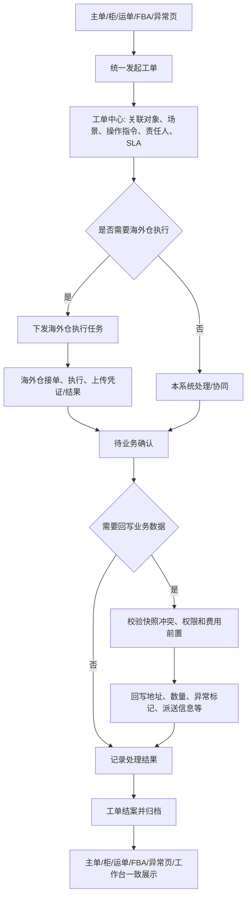
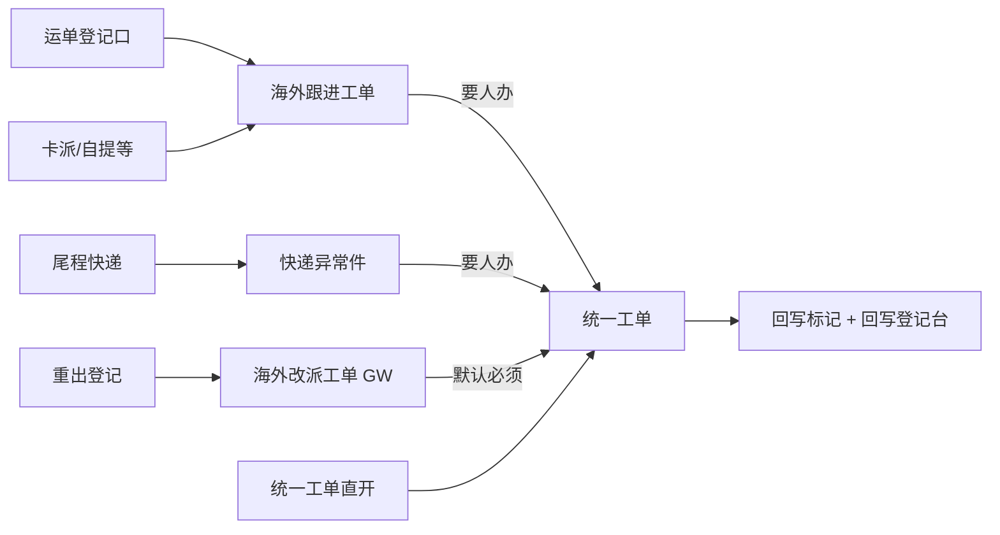
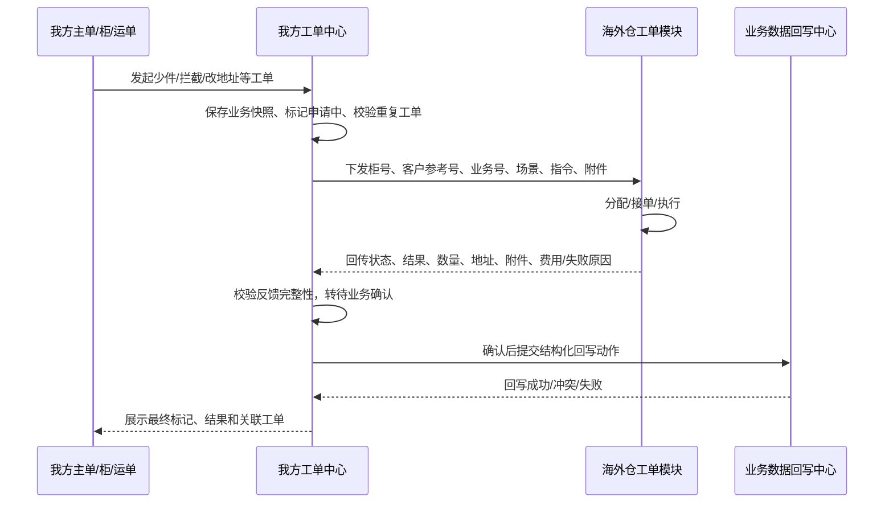
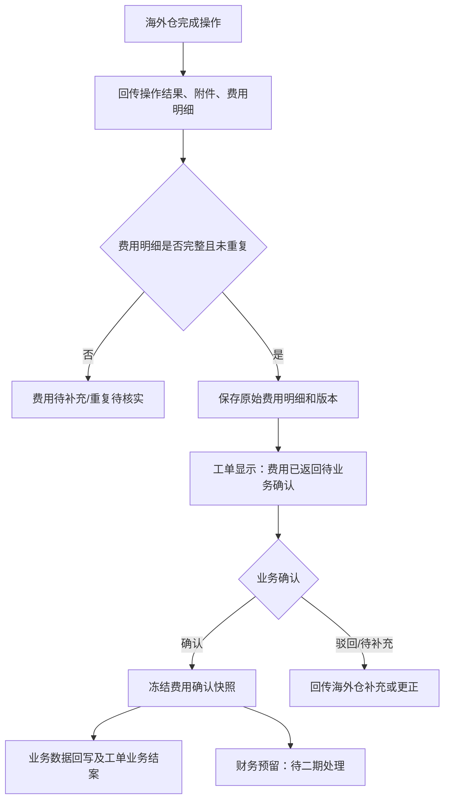

# 工单系统方案 PRD：统一入口、海外仓联动与业务数据回写

> **返回：** [← 旁支计划二导航](../产品部门-导航.html#s-branch-connect) · [旁支计划二总册 #9–#12](../产品部门-旁支计划二-PRD.html#f9) · [计划二分册](工单/工单系统-旁支计划二-PRD.html)

> 文档状态：需求草稿，可进入评审；尚不可直接进入开发或测试
> 主要读者：产品、海外对接组、港前/港后客服、海外仓、关务、财务、前端、后端、测试
> 交付物：本 Markdown PRD
> 资料依据：用户补充；`产品部门/旁支2/工单货物操作流程.docx`；海外对接组需求资料；`工单/` 目录的工作台、详情、新建和场景流程原型；海外仓系统公开前端资源（`http://8.218.254.159:9867`）
> 本文与《旁支1-信号旗与系统ISF对接-PRD.md》分开维护；ISF/信号旗异常仅通过“转工单”与本文衔接。
> 登录验证：2026-09-10 尝试仅只读登录同系统认证服务，服务返回 `502 Bad Gateway`；本文中“海外仓实际系统能力”仅依据公开前端代码，尚未验证账号权限、真实数据和开放 API。
> 最后更新：2026-09-11（补充现网三登记台与统一工单分层打通）

## 1. 需求理解

目前工单入口分散在提单、运单、尾单跟踪、海外仓协同和异常页签，业务不知道应从哪里发起，主管也难以看全量待办。工单发出后与海外仓没有统一的数据联动，很多操作依靠线下表格、消息或人工反馈。海外仓完成少件、拦截、改地址等处理后，工单可能结案，但关联的运单、柜、地址、货物异常标记和费用没有同步更新。

本期方案要让工单成为“协同和留痕中心”，而不是另一个孤立列表：从关联业务单发起、把标准操作指令下发海外仓、接收执行反馈、经确认后回写业务数据，并在详情和列表清楚展示少件、拦截、改地址等标记。

## 2. 本次目标与范围

### 2.1 目标

1. 统一工单入口和场景字典，减少重复建单和漏跟进。
2. 让海外仓操作任务、执行进度、凭证和结果回到工单，不再以线下反馈作为唯一依据。
3. 明确哪些操作完成后应修改提单、柜、运单、FBA、地址、货物异常和费用数据。
4. 让少件、拦截、修改地址等风险标记在关联业务单、工作台和工单详情中一致可见。

### 2.2 本期范围

- 统一入口：主单/分单、柜、运单、FBA、海外仓作业页、异常列表均转到同一新建工单能力。
- 工单场景：少件/破损、拦截、改地址、换标、重出、拍照、换箱、测量、打托、清点、销毁、撕标。
- 海外仓协同：指令下发、接单、处理中、执行反馈、附件/POD、失败/拒绝反馈、催办和 SLA。
- 数据回写：在受控确认点回写标记、地址、货物异常、运单派送方式、海外仓执行状态和费用处理状态。
- 审计：指令版本、操作人、执行人、回写前后值、附件、时间线和关闭原因。

### 2.3 本期不做

- 不替代海外仓 WMS（仓储管理系统）的库内库存、库位、波次或收费计算能力。
- 不让工单自动修改已锁账/已核销的账单；此类事项保留财务确认节点。
- 不把信号旗 ISF、船司轨迹等外部状态直接当作海外仓操作完成；外部异常只可按规则转工单。
- 不假设已有海外仓接口、消息格式或回调能力；这些内容在本文标为 `[待确认]`。

## 3. 已确认信息

- `[已确认]` 当前工单入口分散，且未与海外仓数据联动。（依据：用户补充）
- `[已确认]` 工单处理完后未同步修改关联业务数据。（依据：用户补充）
- `[已确认]` 少件、拦截、修改地址等标记不清晰且数据未同步。（依据：用户补充）
- `[已确认]` 现有工单主状态为：发起 → 待接单 → 处理中 → 待协同 → 已结案。（依据：现有工单原型）
- `[已确认]` 工单支持关联柜号、运单号、FBA 号、附件、转派、驳回、业务联动、SLA、通知配仓组、POD 上传、出库登记 PRO 追踪号和海外仓执行反馈。（依据：现有工单原型）
- `[已确认]` 工单前置需分别校验运单状态和账单锁账/核销状态。（依据：现有工单原型）
- `[已确认]` **同一柜号 / 运单号 / 子单号 + 同一工单类型，未完结时只允许一张在办工单**；再次发起走追加（补充 / 后续指令），不新开平行单。（依据：产品口径 · BR-WO-001）
- `[已确认]` 货物操作流程包括重出、拦截、换标、拍照、换箱、测量、打托、清点、销毁、撕标；拦截费用取决于货物原渠道。（依据：工单货物操作流程）
- `[已确认]` 海外对接组是港后处理枢纽；**现网登记台（海外跟进工单、快递异常件、改派GW）保留**，需处置时再进统一工单；运单登记口直进海外跟进工单。（依据：2026-09-11 产品对齐）
- `[已确认]` 海外仓系统存在独立的工单工作台，支持工单新建、编辑、分配、接单、完成、关闭、客户回复、内部备注、详情、附件和导出。（依据：海外仓系统公开前端代码）
- `[已确认]` 海外仓工单以“柜号”作为新建时的必填查询入口；输入柜号后可自动带出客户、客户参考号、关联业务号、货件/货件明细。（依据：海外仓系统公开前端代码）
- `[已确认]` 海外仓工单有工单类型、优先级、标题、描述、关联业务号、客户、货件、附件等字段；优先级可按工单类型规则自动带出。（依据：海外仓系统公开前端代码）
- `[已确认]` 海外仓系统具备工单规则、处理组和操作指令三类配置能力。（依据：海外仓系统公开前端代码）

## 4. 方案总览



图后说明：海外仓“完成”只能代表仓内任务结束；只有经过业务确认、必要数据回写成功后才可以结案。少件、拦截、改地址等状态必须写入关联业务对象，而非只留在工单备注中。

### BR-WO-001：同一业务键 + 同一工单类型 · 未完结只允许一张工单（可追加）

**查重键（任一命中即参与查重，按场景配置的关联对象取）：**

| 键 | 说明 |
| --- | --- |
| 柜号 | 整柜/柜子计划类场景 |
| 运单号 | 主运单 / 根运单 |
| 子单号 | 快递子单、货件号等分票标识 |

**规则：**

1. **同一查重键 + 同一工单类型（场景）**，在已有工单**未完结**（非已结案 / 已驳回 / 已撤回）时，**只允许存在一张在办工单**，禁止再开平行主单。
2. 再次发起同类型流程时：系统提示已有在办工单，引导进入该工单，在后面**继续追加**（补充说明 / 「新增后续指令」升版本），不得默认新建。
3. 不同类型（不同场景编码）可并行存在多张在办工单（如同一运单同时有「拦截」与「索赔」），各自独立查重。
4. 查重不只比「运单号相同」：柜号、子单号、重出后的新/旧运单号均按根对象条关联（见 BR-WO-016 / BR-WO-017）。
5. 需要拆分不同仓、不同柜或不同执行人时：仍挂在同一母工单下，用多条指令版本 / 外部执行单，保留主从关系。

**追加方式：** 工单详情「新增后续指令」或提交入口命中查重后「进入补充」；费用、附件、仓结果挂对应版本，不堆在母工单备注。

### BR-WO-016：拦截后续指令 · 三级关联（母工单 + 指令版本 + 外部执行单）

**需要关联，且不能只靠「运单号相同」。**

```
母工单 OP-xxx（根运单/柜号/货件 ID，重出不断链）
  ├─ V1：第一次拦截指令 → 美库工单 A
  ├─ V2：拦截后新指令（改留仓/改渠道/换标…）→ 美库工单 B
  └─ V3：再次变更 → 美库工单 C
```

| 层级 | 标识 | 挂载内容 |
| --- | --- | --- |
| 母工单 | 操作母工单号（如 OP-001 / WO-xxx） | 根运单、柜号、货件 ID、客户；重出后保留「原运单号 + 新运单号 + 生效时间」 |
| 指令版本 | V1 / V2 / V3…；记录上一版本 | 本版要求、是否替代上一版、时限、附件、费用确认、结果 |
| 外部执行单 | 美库工单号 | 仓内受理/执行状态；与本版一对一（或一对多任务时仍挂在该版本下） |

**规则：**

1. 费用、地址确认、面单、照片、海外仓结果**必须挂对应版本**，禁止全部堆在母工单备注。
2. 上一版**尚未被海外仓受理**：可申请「撤回并替换」该版（如撤回 V1 重发）；**已受理或执行中**：必须新建下一版（V2），并向海外仓明确「后续指令 / 替代关系」。
3. 某一版「无法拦截」等终态**只关闭该版本**，母工单保持打开，允许继续发新指令。
4. 母工单仅在**货物最终完结且无待执行版本**时关闭。

**交互（工单详情）：**

- 展示「指令版本链」：上一条指令是什么、海外仓执行到哪、是否被替代。
- 「新增后续指令」自动带出柜号、原/新运单、客户、货件范围、当前状态、上一版结果；用户只填新要求、是否替代上一版、时限、附件、费用确认。
- 详见 UI-WO-016；原型：`工单详情-MVP.html#WO-202605-INT`。

### BR-WO-017：重出新单号必须关联原母工单

腾信/GW **重出产生的新运单号**，必须写入同一母工单根对象条（原运单号 + 新运单号 + 生效时间），并与当前指令版本关联。

**禁止：**

1. 仅因「新运单号」另开一张平行主工单；  
2. 新单号只写在海外跟进备注或 GW 备注、不挂母工单；  
3. 已填新单号却选择「新建母工单」而未关联既有在办母工单。

**双入口（旁支计划二 #10）：**

| 入口 | 动作 |
| --- | --- |
| 海外跟进登记「新增数据」 | 问题处理意见=改快递重出 → 填关联母工单 + 重出新单号 → 转统一工单 |
| 统一工单提交入口 / 新建 | 场景「改快递·需重出」→ 带入母工单与新单号字段 |
| 改派重出 GW | 规则台；同样强制母工单；保存后转统一工单 |

任一入口发起后，系统按根运单/柜号/货件 ID 查重；命中未结母工单则关联并升版本或补充，不默认新建平行主单。

### BR-WO-018：场景「海外仓推送规则」（工单类型 + 港前/港后）

每个「工单类型 + 港前/港后」配置一条推送规则；客服**不**勾选「要不要推送」，只点「提交执行」，系统按规则 + 目标仓能力自动分支。

#### 基础条件

| 项 | 说明 |
| --- | --- |
| 工单类型 | 如换标、快递拦截、重出、仓内操作… |
| 阶段 | 港前 / 港后 |
| 海外仓 | 全部，或指定仓 |
| 港前港后判定 | 继承轨迹/状态规则 |
| 生效状态、优先级 | 启用/停用；多规则命中按优先级 |

#### 流程节点 · 审批流（场景配置列）

| 项 | 样板「换标·港前」 | 配置位 |
| --- | --- | --- |
| 挂靠工单状态 | **处理中** | 审批流 · 挂靠状态（处于该状态时跑关联审批流） |
| 是否确认费用 | **必须** | 审批流 · 费用确认（不需要 / 可选 / 必须） |
| 关联审批流编号 | **AF-LABEL-PRE** | 审批流主数据编号 |
| 关联审批流名称 | 换标港前标准流 | 随编号带出，可改展示名 |

> 仓可操作确认、部门经理审批、审批条件等节点细则落在**审批流主数据**内，场景表只关联编号+名称。港后拦截样板关联 `AF-INT-POST`（含仓确认 + 限时达经理）。未通过不得「提交执行」/推送。

#### 前置 / 后置状态（场景配置列）

| 项 | 含义 | 样板 |
| --- | --- | --- |
| 前置·允许运单 | 发起/确认时运单须落在列表内；「—」不限制 | 换标港前：— |
| 后置·禁止运单 | 运单已进入列表状态则**不可确认写回**（与账单无关） | 港后改派送：自提下载,移交快递,已签收 |
| 前置·账单 | 不限 / 未锁账且未核销 | 费用类：未锁账且未核销 |
| 结案·期望状态 | 结案后期望写回的运单状态；「—」不强制 | 可选 |

配置维护：`SLA数据维护-MVP.html`（粉列审批流 + 黄列前置后置 + 紫列推送 + 「换标·港前」样板卡）；详情演示：`工单详情-MVP.html#WO-202605-LABEL` / `#WO-202605-014-blocked`。

#### 执行动作（提交执行时 / 确认后写入）

| 项 | 样板「换标·港前」 | 配置位 |
| --- | --- | --- |
| 柜子计划 | Move Type → **留仓** | 工单执行动作配置：触发条件、写入字段、目标值 |
| 柜子备注 | 写入**换标要求**（海派跟踪表对应柜备注） | 工单执行动作配置：写入位置、备注模板 |

#### 外部执行

| 项 | 规则 | 配置位 |
| --- | --- | --- |
| 是否需要海外仓执行 | **是** | 工单执行策略配置 |
| API 仓下发 | **提交执行后自动推送** | 海外仓档案（是否 API）+ 推送规则配置 |
| 无接口仓 | 生成线下操作指令 →「待人工发送」→ 客服「已发送」 | 同上 |
| 接口失败 | 「推送失败」，可重试 | 推送规则配置 |

#### 结果回写与完结

| 仓类型 | 回写字段 | 配置位 |
| --- | --- | --- |
| API 仓 | 处理结果、实际费用、回执附件、**修改地址**、**修改渠道** | 回写规则配置 |
| 无接口仓 | 客服手工填同上字段 + 上传回执 | 回写方式配置 |
| 完结条件 | 结果已回写；若有费用则费用已确认 | 费用确认规则 + 回写规则 |

> 说明：港前换标时「原渠道」业务口径仍保留为原始渠道字段；「修改渠道」仅在本指令确需改渠道时由回写规则写入，不得静默覆盖。

### BR-WO-019：场景审批流与前置/后置状态

每个场景在配置表维护审批节点与状态卡控，运行时只读配置，不在前端手勾。

1. **审批流**：场景配置挂靠工单状态，并**关联审批流编号 + 名称**；运行时拉取该审批流节点（费用确认 / 仓可操作 / 经理审批等）。未通过不得离开挂靠状态或「提交执行」。
2. **前置状态**：运单允许列表 + 账单前置；发起与确认时**重读最新状态**。
3. **后置状态**：运单禁止列表命中则不可确认写回；结案期望状态可选写入（不静默覆盖已签收等节点）。
4. 与推送前条件（紫列）分工：关联审批流管「人/节点是否通过」；推送前条件管「附件/费用快照等执行就绪」。

### BR-WO-002：工单与业务数据分层

工单记录“谁提出什么诉求、谁处理、处理证据和处理结果”；业务单记录“当前有效的地址、货物异常、派送方式、柜/运单状态和费用状态”。工单未经确认不得直接覆盖核心业务数据；回写必须产生可追溯的前后值。

### BR-WO-003：海外仓反馈不是自动结案

海外仓上传“已完成”后，工单先进入“待业务确认”。只有无需回写、或所有必需回写成功且有权人确认后，才进入“已结案”。反馈为不能处理、部分完成、费用待确认时，工单保持处理中或待协同。

### BR-WO-004：异常标记统一展示

少件、拦截、修改地址、重出等标记以结构化字段保存，必须在以下位置一致展示（不只写备注）：

1. 关联主单 / 柜 / 运单详情顶部风险区  
2. 工单工作台与工单时间线  
3. **海外对接组各派送类型列表**（按销售产品/派送方式分册）：尾程快递件、卡派跟进、海外卡派自提件、一件代发、整柜尾端派送等  

**与「异常登记」区分：**

| 列/标记 | 来源 | 含义 |
| --- | --- | --- |
| 异常登记（如快递件） | 登记台（快递异常件等） | 发现什么异常类型 |
| **工单异常标记** | 统一工单结构化风险标签 | 正在办什么 / 办到哪（申请中·已拦截·改址生效·重出中…） |

同一行可同时有「异常登记」与「工单异常标记」。点击工单异常标记可跳转关联未结/最近工单。无未结工单且无历史风险时显示「—」。

### BR-WO-015：按派送类型同步工单异常标记

统一工单提交后，按关联运单的**派送类型/销售产品**写入对应海外对接列表的「工单异常标记」字段；工单状态或风险标签变更时实时刷新。结案后保留最终态（如「拦截·已解除」「重出·已完成」），不因结案清空列（历史可点进工单）。

## 5. 统一入口方案

### 5.1 入口收敛

| 原业务位置 | 本期入口动作 | 自动带入 | 不再做 |
| --- | --- | --- | --- |
| 主单/提单详情 | 发起工单 | 主单号、客户、航线、关联柜 | 不在提单页另做独立异常流转 |
| 柜详情/装柜计划 | 发起货物操作工单 | 柜号、柜型、装柜/提柜状态、装柜地址 | 不通过共享表单独记录主过程 |
| 运单/尾单详情 | 发起工单 | 运单号、派送方式、地址、当前节点、PRO | 不在尾单异常栏单独闭环 |
| FBA 详情 | 发起工单 | FBA 号、仓点、预约/入库状态 | 不另建 FBA 专属工单状态 |
| 海外仓作业页 | 新建或反馈已有任务 | 海外仓、仓内作业、关联柜/运单 | 不直接修改主业务数据 |
| 异常件页签 | 查看/转统一工单 | 异常类型、发现时间、来源登记台 | **现网登记台保留**，见 §5.3；不另建第三套异常列表 |

### 5.2 新建工单最小字段

| 字段 | 说明 | 来源/维护方 | 必填 |
| --- | --- | --- | --- |
| 工单场景 | 少件、拦截、改地址等标准场景 | 发起人选择，场景字典维护 | 是 |
| 关联对象 | 主单、分单、柜、运单、FBA；至少一个 | 从入口自动带入，允许补充 | 是 |
| 处理对象 | 柜/运单/货物明细/地址/海外仓任务 | 发起人选择 | 是 |
| 诉求与原因 | 业务描述、客户指令、异常原因 | 发起人 | 是 |
| 操作指令 | 场景化指令明细 | 系统预填 + 发起人补充 | 是 |
| 目标海外仓 | 需要仓内操作时的执行仓 | 路由规则/发起人 | 按场景 |
| 附件 | 客户指令、照片、标签、地址证明等 | 发起人 | 按场景 |
| 是否涉及费用 | 是/否/待确认 | 发起人；后续财务确认 | 是 |
| 回写动作预览 | 系统提示本单完成后可能修改的数据 | 场景配置 | 是（只读） |

`[待确认]` 同一票多柜、同一柜多运单、跨海外仓转运时，应采用“一张主工单 + 多个执行任务”还是“多张独立工单”；推荐前者，便于客户沟通和费用合并，但需要明确子任务的结案规则。

### 5.3 现网登记台与统一工单分层（2026-09-11）

现网已有三套登记/跟进入口，**本期不砍菜单**；统一工单只做「要人办」的执行与回写中枢。运单侧登记口**直进海外跟进工单**。

| 现网模块 | 业务定位 | 典型来源 | 与统一工单关系 |
| --- | --- | --- | --- |
| 海外跟进工单 | 非快递问题登记台（名含工单，实为登记/跟进） | 运单登记口；卡派/自提等 | 仅登记可停本台；需处置则转/提交统一工单 |
| 快递异常件（子单） | 快递异常事实登记 | 尾程快递件、业务/客服反馈 | 同上；异常类型字典仍在本台 |
| 海外改派工单（GW） | 快递重出/改派规则与单据 | 重出登记 | **默认必须**关联统一工单「重出」；规则仍在 GW |



#### BR-WO-011：双轨入口

保留三登记台 + 统一工单直开。纯观察停登记台；要人办必须关联**已提交**统一工单后，登记台才可标处理中/已处理。

#### BR-WO-012：处置档位

| 档位 | 系统行为 |
| --- | --- |
| 仅登记 | 观察中；转统一工单可选 |
| 建议转 | 保存后提示建议转 |
| 必须转 | 待转工单；无已提交工单禁止已处理/放行结案 |

重出默认必须；修改收件/派送方式必须或建议；未提取仅备注=仅登记。细表配置化 `[待确认]`。

#### BR-WO-013：提交进列表；费用卡执行不卡建单

草稿不进待办池；**提交**后进工作台。费用未确认可提交并标「费用待确认」；未确认前禁止下发执行/加收（高额拦截/重出/销毁默认先确认）。

#### BR-WO-014：双向关联

登记台列「关联统一工单号」；统一工单详情「来源登记台+单号」。防重复主单见 BR-WO-001。

原型：`登记-海外跟进-MVP.html`、`登记-快递异常件-MVP.html`、`登记-海外改派重出-MVP.html`。

## 6. 海外仓联动方案

### 6.0 海外仓现有工单模块对齐结论

海外仓系统的公开前端代码显示，其工单模块已经有一套可复用的“柜号定位 → 自动带出业务对象 → 工单处理 → 操作记录”能力。我们系统不应再从零做一套无关联的海外仓任务列表，而应在双方对接时复用下列业务契约。

| 海外仓已见能力 | 对我们系统的对齐要求 | 本期处理 |
| --- | --- | --- |
| 柜号为必填入口 | 从我方柜详情/主单/运单发起时，必须自动传入柜号；海外仓回传也以柜号匹配 | `[建议]` 柜号为跨系统主匹配键之一，但不能作为唯一键 |
| 柜号带出客户、客户参考号、关联业务号、货件明细 | 我方需同时提供客户参考号、我方业务号和货件/运单关联键 | `[待确认]` 双方字段名称、唯一性和优先级 |
| 类型、优先级、标题、描述、附件 | 我方场景映射为海外仓工单类型；操作说明写入标题/描述/指令，不只写备注 | `[建议]` 在我方保存对方类型编码和中文文案 |
| 分配、接单、完成、关闭 | 任务状态至少同步“待接单、处理中、已完成待确认、已关闭/失败” | `[待确认]` 外部状态码和回调/查询方式 |
| 客户回复、内部备注、处理日志 | 外部回复和备注应以时间线追加到我方工单，不覆盖我方处理记录 | `[建议]` 区分“可见客户”与“内部可见”权限 |
| 工单规则、处理组、操作指令 | 我方按场景配置路由、SLA、必传附件和回写动作；海外仓按其处理组接单 | `[待确认]` 是否可获取/维护对方字典，或仅建立静态映射 |

### 6.0.1 跨系统工单流程图



该图中的“下发/回传”目前是业务目标，不代表海外仓已向外部开放这些接口。公开代码显示海外仓后台内部存在 `/admin/workOrder` 系列接口，但其鉴权方式、是否允许第三方调用及接口契约尚未确认。

### 6.1 任务模型

每张需海外仓操作的工单创建一个或多个“海外仓执行任务”。任务不是新业务单，而是工单下的执行明细。

| 状态 | 触发人 | 系统结果 |
| --- | --- | --- |
| 待下发 | 工单处理人 | 校验指令、附件、目标海外仓和费用前置 |
| 待海外仓接单 | 系统/处理人 | 向海外仓发送任务或开放待接任务 |
| 海外仓处理中 | 海外仓 | 回传接单人、开始时间、预计完成时间 |
| 待补资料 | 海外仓/客服 | 原任务保留，工单转待协同，明确缺什么资料 |
| 已完成待确认 | 海外仓 | 回传结果、数量、地址、照片/POD、费用反馈 |
| 无法执行/部分完成 | 海外仓 | 回传原因、实际完成项和建议；不得自动结案 |
| 已确认 | 业务处理人 | 触发对应业务数据回写 |

### 6.2 下发给海外仓的最小信息

- 任务号、主工单号、场景、优先级、SLA 截止时间。
- 关联主单/分单/柜号/运单/FBA 号，避免海外仓按备注猜测对象。
- 操作对象和操作指令：例如“柜号 A 的第 3 托换标”“运单 B 改为地址 C”“清点 SKU X”。
- 目标地址（省/州、市、邮编、详细地址、联系人、电话）和地址版本号，适用于改地址/重出。
- 操作前快照：件数、箱数、标签、当前派送方式、当前异常标记。
- 附件和必传凭证要求：照片数量、POD、清点表、销毁证明等。
- 是否涉及费用及“已确认/待确认/不涉及”状态；未确认费用是否允许执行由场景配置决定。

`[待确认]` 海外仓的真实联动方式是 API、文件、共享表还是人工门户？是否可接收任务、回传任务状态、上传附件、回传费用和作业明细？本方案先定义业务契约，不假定技术实现。

### 6.3 反馈校验

- 少件/清点：海外仓必须回传实收件数、差异数量、差异原因、现场照片/清点表；缺任一项不得确认回写。
- 拦截：必须回传是否拦截成功、当前货物位置、是否已产生拦截费、下一步建议；已出库/已交承运商时需回传不可拦截原因。
- 改地址：必须回传新地址是否校验通过、是否已通知承运商、是否已产生改址费；不得只写“已通知”。
- 换标/换箱/打托/测量/撕标/销毁：必须回传实际执行数量、附件和异常说明；销毁还需销毁凭证 `[待确认]`。

### 6.4 一期纳入：海外仓费用回传与业务确认

`[已确认]` 海外仓当前能够返回费用。本期应把费用作为工单执行反馈的一部分接收、展示、确认和留痕；但在财务调研完成前，**不得直接创建或修改应收、应付、付款、锁账、核销记录**。

#### BR-WO-007：费用反馈与业务结案分开

海外仓完成操作后，可同时返回操作结果和费用。工单的“业务处理状态”与“费用处理状态”必须分开：业务已完成不等于费用已入账；费用待确认也不应阻塞少件、拦截、地址等非财务数据的确认回写。

| 维度 | 一期状态 | 含义 |
| --- | --- | --- |
| 工单业务状态 | 待反馈 / 已完成待业务确认 / 业务已结案 | 判断操作是否已处理和业务数据是否已回写 |
| 费用反馈状态 | 无费用 / 待海外仓反馈 / 已返回待业务确认 / 已业务确认 / 已驳回 / 已撤销 | 判断费用明细是否完整、是否认可，不代表已入账 |
| 财务预留状态 | 未推送 / 待二期处理 / 已推送 / 推送失败 | 一期只保存状态；二期接入财务模块后启用 |

#### BR-WO-008：费用按明细和版本保存，不覆盖历史

每一条海外仓费用必须有“外部费用明细 ID + 费用版本”。原金额、币种、数量、计费单位、附件和返回时间原样保存；海外仓后续调价、撤销或补费时生成新版本/调整记录，不直接覆盖已确认快照。

#### 一期费用回传字段

| 字段 | 说明 | 本期使用 | 二期作用 |
| --- | --- | --- | --- |
| 我方工单号 | 关联工单唯一标识 | 必填 | 财务追溯来源 |
| 海外仓任务号 | 外部执行任务/工单标识 | 必填 | 对账与幂等键 |
| 外部费用明细 ID | 海外仓每条费用唯一 ID | 必填；没有则需确认组合去重键 | 防重复入账、识别调整 |
| 费用版本/调整标记 | 原始、补费、冲减、撤销 | 必填 | 保留费用变更链路 |
| 费用代码/名称 | 海外仓原始费用项目 | 必填 | 后续映射本系统费用项 |
| 费用方向 | 海外仓向我方收费/我方可向客户转收/暂不明确 | `[待确认]`；一期可先为“待判定” | 生成应付/应收草稿的前置 |
| 原币种、原币金额 | 费用原始金额 | 必填 | 汇率、税额、入账金额基础 |
| 数量、计费单位、单价 | 例如 2 pallet、1 container、3 day | 有则返回 | 财务复核和账单展示 |
| 发生时间/服务期间 | 实际操作时间或计费区间 | 必填 | 会计期间、账期判断 |
| 关联对象 | 柜号、运单、FBA、货物/托盘、地址或操作项 | 至少关联一个 | 费用归属与拆分依据 |
| 费用原因/操作说明 | 如拦截费、改址费、换标费、少件清点费 | 必填 | 财务和客户解释依据 |
| 附件 | 账单、照片、POD、作业凭证等 | 按费用类型配置 | 对账、请款、争议处理 |
| 业务确认结果/原因 | 确认、驳回、待补充 | 必填 | 二期只取“已业务确认”快照 |
| 返回时间、确认人、确认时间 | 操作审计 | 必填 | 对账与责任追溯 |

#### 一期处理流程图



#### 一期页面设计

工单详情新增“海外仓费用”页签，放在“海外仓执行反馈”之后，至少展示：费用反馈状态、外部费用 ID、费用名称、原币金额、数量/单位、关联柜/运单、发生时间、附件、版本、确认结果和确认原因。

操作只提供“确认费用”“驳回并要求补充”“标记无需向客户转收”“查看费用历史”。一期不提供“生成应收/应付”“付款”“锁账”“核销”按钮。

### 6.5 二期财务预留设计

二期不重造费用数据，而是从一期“已业务确认且未撤销”的费用快照生成财务待处理记录。财务模块接入后，费用确认快照应保持不可编辑；更正只能通过海外仓新版本或业务发起调整单完成。

#### 预留对象关系


| 二期预留字段 | 一期如何保存 | 二期如何使用 |
| --- | --- | --- |
| `financialSyncStatus` | 默认“待二期处理”，不触发财务动作 | 控制推送、重试、失败处理 |
| `financialDraftRef` | 为空 | 保存财务待处理/费用草稿关联号 |
| 费用方向与承担方 | 允许“待判定”；业务确认时可补充 | 决定应付、应收或不入账 |
| 本系统费用项映射 | 保存海外仓原始费用代码；映射字段为空可接受 | 匹配费用科目、服务商收费项、客户收费项 |
| 汇率、折算金额、税率/税额 | 一期保持为空，不计算 | 按财务确认的汇率来源、日期和税制补齐 |
| 所属公司、核算主体、会计期间 | 一期预留空字段 | 根据归属规则生成会计记录 |
| 账单/请款/付款/核销关联号 | 一期均为空 | 财务完成后回写只读关联号和状态 |
| 财务锁定标识 | 默认未锁定 | 锁账/核销后限制调整，调整走冲销/补差流程 |

#### BR-WO-009：财务二期只消费确认快照

二期财务模块只能读取“已业务确认、未撤销、未成功推送”的费用快照。工单原始费用、海外仓调整历史和附件始终保留；财务入账失败仅将 `financialSyncStatus` 置为“推送失败”，不得把工单业务状态回退为未完成。

#### BR-WO-010：财务推送幂等与调整

建议财务推送唯一键为：`我方工单号 + 海外仓任务号 + 外部费用明细 ID + 费用版本 + 费用方向`。同一键成功后不允许重复生成财务草稿；若海外仓发生调整，必须使用新版本生成调整/冲减待处理记录，不得修改已锁定财务记录。

## 7. 标记与数据回写

### 7.1 统一标记模型

| 标记 | 适用对象 | 值 | 何时出现 | 何时清除/失效 |
| --- | --- | --- | --- | --- |
| 少件标记 | 运单、柜、货物明细 | 无/待核实/已确认/已补齐/已赔付 | 少件工单发起时为待核实；海外仓反馈后更新 | 补齐/赔付确认后保留历史，当前态变为已补齐/已赔付 |
| 拦截标记 | 运单、柜 | 无/申请中/已拦截/拦截失败/已解除 | 拦截工单创建即申请中 | 解拦成功或新指令完成后更新；历史不删除 |
| 地址变更标记 | 运单、派送任务 | 无/申请中/已生效/变更失败 | 改地址工单创建即申请中 | 承运商/海外仓确认后更新为已生效或失败 |
| 海外仓作业标记 | 柜、运单 | 无/待执行/执行中/待确认/已完成/异常 | 创建海外仓任务时 | 工单结案后保留最终态和关联工单号 |
| 费用待确认标记 | 工单、费用关联对象 | 无/待确认/已确认/已拒绝 | 识别可能产生费用时 | 财务或授权人完成确认后更新 |

### 7.2 场景回写矩阵

| 场景 | 处理完成后可回写 | 回写前置 | 禁止自动回写 |
| --- | --- | --- | --- |
| 少件/破损 | 少件标记、实收/差异数量、异常原因、附件索引、海外仓任务结果 | 海外仓明细+凭证齐全，业务确认 | 不自动修改原始下单件数、结算金额、库存 |
| 拦截 | 拦截标记、实际位置、拦截结果、承运状态、费用待确认标记 | 海外仓/承运商反馈，处理人确认 | 不自动改变已签收/已出库等实际节点 |
| 修改地址 | 地址变更标记、新地址版本、承运商通知结果、预计派送信息 | 新地址字段齐全且海外仓/承运商确认 | 未确认前不覆盖当前有效派送地址 |
| 换标 | 标签操作结果、实际处理数量、附件索引 | 海外仓回传照片及数量 | 不自动更改客户/货物主数据 |
| 重出 | 新运单/PRO、派送方式、目标地址、旧单与新单关联 | 新单号和费用状态确认 | 不删除旧运单和历史轨迹 |
| 清点/拍照/测量 | 作业记录、实测结果、附件索引 | 海外仓反馈完整 | 不自动覆盖已确认申报/结算值 |
| 换箱/打托/撕标/销毁 | 作业结果、数量、凭证、费用待确认 | 凭证齐全，必要时业务确认 | 不自动更新库存/费用终态 |

### BR-WO-005：先快照、后回写

发起工单时记录关联业务数据快照；完成确认时比较当前值与发起快照。若工单处理期间业务数据已被他人修改，系统必须提示冲突，禁止静默覆盖。处理人可重新加载最新数据、取消回写或发起新的变更版本。

### BR-WO-006：费用与业务数据分别确认

海外仓反馈费用后，工单可显示“费用待确认”，但不得自动新增应收/应付或修改锁账/核销账单。财务确认后才允许调用现有费用业务联动；费用未确认不阻断“少件/地址/拦截结果”这些非金额字段的回写，除非场景配置明确要求。

## 8. 工单状态与角色职责

| 当前状态 | 触发动作 | 责任角色 | 下一状态 | 关键结果 |
| --- | --- | --- | --- | --- |
| 草稿 | 保存未提交 | 发起人 | 草稿/待接单 | 可继续编辑，不下发海外仓 |
| 待接单 | 提交工单 | 路由系统 | 处理中/已驳回 | 指派港前、港后、关务或海外仓协调人 |
| 处理中 | 接单 | 处理人 | 待协同/待业务确认/已驳回 | 拆分指令、补资料、判断费用 |
| 待协同 | 下发海外仓或等待客户/财务 | 海外仓/客户/财务 | 处理中/待业务确认 | 记录等待方、截止时间和催办次数 |
| 待业务确认 | 海外仓反馈已完成 | 发起人/业务处理人 | 处理中/已结案 | 核对结果，确认是否回写 |
| 回写处理中 | 确认回写 | 系统 | 已结案/回写失败 | 完成所有允许的字段更新或明确失败原因 |
| 已结案 | 所有处理和必要回写完成 | 系统/授权人 | 归档 | 固化结果、标记和审计 |
| 已驳回/已撤回 | 驳回/撤回 | 处理人/发起人 | 终态 | 不下发或取消未开始的海外仓任务 |

| 角色 | 主责 |
| --- | --- |
| 业务员/发起人 | 选择场景、补充客户指令、确认业务处理结果 |
| 港前客服 | 港前柜计划、拦截、换标、预报海外仓等接单与协同 |
| 港后客服 | 改地址、改派送、私卡/FBA/自提等尾端协同 |
| 海外仓 | 接收/执行任务、反馈数量/结果/照片/POD/费用，不直接修改主业务数据 |
| 海外对接组 | 查看港后全局进度、催办、异常升级和跨组协调 |
| 财务 | 费用确认、费用联动后的结案确认 |
| 管理员/配置人 | 场景字典、路由、SLA、回写规则和权限配置 |

## 9. 页面调整建议

### UI-WO-001：统一“发起工单”入口

在主单、柜、运单、FBA、异常页使用同一个入口和同一个新建弹窗。弹窗先显示“已关联对象”，再选择场景；不得让用户重复输入当前页面已有的单号。

### UI-WO-002：工单详情的“执行与回写”分区

工单详情除基本字段和时间线外，新增三个固定分区：

1. **操作指令**：处理对象、目标结果、当前地址/新地址、数量、附件、费用状态。
2. **海外仓执行反馈**：任务状态、执行人、实际结果、差异、照片/POD、费用反馈。
3. **业务数据回写**：回写字段清单、发起快照、当前值、拟写入值、冲突提示、确认人、回写结果。

### UI-WO-003：关联业务单风险区与派送列表

主单/柜/运单/FBA 详情顶部显示结构化标签，例如“少件·待核实”“拦截·申请中”“地址变更·已生效”“重出·执行中”。点击标签进入对应工单；若同一对象有多张未结工单，展示数量和最高风险等级。

海外对接组各派送类型列表增加只读列「工单异常标记」（可多标签），样式与详情风险区同源；快递件保留「异常登记」列，二者并列，不互相覆盖。

### UI-WO-016：指令版本链与新增后续指令

工单详情（母工单）固定展示：

1. **根对象条**：柜号、根运单、原/新运单（含生效时间）、货件 ID、客户 — 不因重出换号断链。  
2. **指令版本链**：时间序卡片，每卡含版本号、上一版、指令摘要、是否替代、美库工单号、仓内状态、本版费用/附件入口。  
3. **新增后续指令**（抽屉）：自动带出根对象 + 当前状态 + 上一版结果；仅编辑新要求、是否替代上一版、时限、附件、费用确认。  
4. 未受理版可「撤回并替换」；已受理/执行中禁用撤回，仅允许升版并勾选「向海外仓声明替代关系」。  

规则见 **BR-WO-016**；演示原型：`工单详情-MVP.html#WO-202605-INT`。

### UI-WO-017：关联工单与海外仓任务号

统一工单（新建 / 详情 / 工作台列表）固定展示两个关联字段：

| 字段 | 说明 |
| --- | --- |
| **关联工单** | 指向母工单或其他协同在办工单（WO / OP）。重出、后续指令必须挂母工单；空则本单可作为新建母工单。 |
| **海外仓任务号** | 海外仓执行单号（如美库 MK-xxx）。与本系统工单号分开存储；提交执行/API 推送成功或仓回传后写入；无接口仓可手工维护。 |

规则：

1. 关联工单变更须写时间线；**同一柜号/运单号/子单号 + 同一工单类型**有未完结工单时禁止另开平行主单，应追加后续指令（见 BR-WO-001 / BR-WO-016）。  
2. 海外仓任务号挂在对应**指令版本**上时，详情「海外仓执行反馈」与列表列同步展示最新有效号。  
3. 工作台支持按工单号 / 关联工单 / 海外仓任务号检索。

演示：`新建工单-MVP.html`、`工单详情-MVP.html`、`工单工作台-MVP.html`、`海外异常统一工单-流程与页面原型.html`。

### UI-WO-004：工作台分栏

工作台以“待我接单、我处理中、待海外仓、待我确认、回写失败、已结案”作为主视图；港前/港后/异常件只是筛选维度，避免不同页签重复记录同一工单。

## 10. 异常与边界

| 编号 | 场景 | 系统处理 | 用户看到什么 |
| --- | --- | --- | --- |
| EX-WO-001 | 同一柜号/运单号/子单号 + 同一工单类型已有未完结工单 | 禁止平行新建；提示进入既有工单「追加 / 新增后续指令」 | “已有在办工单 WO-xxx（类型：拦截），请追加后续指令，不可重复开单” |
| EX-WO-002 | 海外仓无法接单 | 保留原因，转待协同，支持转派其他仓/人工处理 | “海外仓未接单：原因…” |
| EX-WO-003 | 海外仓只回传口头结果无凭证 | 不允许进入待业务确认 | “缺少必传反馈：照片/清点表/POD” |
| EX-WO-004 | 改地址期间地址已被其他人修改 | 阻断自动回写，展示发起快照、当前值、拟写入值 | “地址数据已变化，请确认使用哪个版本” |
| EX-WO-005 | 少件结果与原货物明细不一致 | 标记为差异，要求补充明细和原因 | “实收与原件数不一致，待核实” |
| EX-WO-006 | 已锁账/已核销仍需修改费用 | 不更新费用，转财务待协同 | “账单已锁定/核销，需财务确认” |
| EX-WO-007 | 任务部分完成 | 记录已完成项和未完成项，主工单不结案 | “部分完成，待继续处理” |
| EX-WO-008 | 工单执行后回写失败 | 保留海外仓结果，状态为回写失败并自动通知责任人 | “执行已完成，业务数据未同步成功” |

## 11. 验收标准

- **AC-WO-001** Given 用户从运单详情发起“改地址”工单；When 打开新建页面；Then 系统自动带入运单号和当前有效地址，用户只需填写新地址、原因和附件。
- **AC-WO-002** Given 同一柜号（或运单号/子单号）+ 同一工单类型已有未完结工单；When 再次从统一入口/登记台/业务页发起同类型；Then 系统拦截平行新建，提示已有 WO-xxx，引导「进入追加 / 新增后续指令」；查重键含柜号、运单号、子单号。
- **AC-WO-002a** Given 同一运单已有未完结「拦截」工单；When 发起不同类型「未上架索赔」；Then 允许新建索赔工单（不同类型不互斥）。
- **AC-WO-002b** Given V1 已下发且美库已受理；When 业务要改留仓；Then 必须创建 V2（不可撤回替换 V1），并向美库声明替代关系；费用/附件挂在 V2。
- **AC-WO-002c** Given V1 反馈「无法拦截」并关闭该版；When 业务继续发改渠道指令；Then 母工单仍打开，可建 V2；母工单不因单版失败而结案。
- **AC-WO-002d** Given 同类型工单已结案；When 再次发起同类型；Then 允许新建工单（完结后不占用唯一槽位）。
- **AC-WO-003** Given 海外仓接收少件任务并回传实收数量、差异原因、照片和清点表；When 业务处理人确认；Then 系统将少件标记和实收/差异数量回写至关联运单/货物异常区，并记录前后值。
- **AC-WO-004** Given 改地址工单在海外仓确认新地址有效；When 业务确认回写；Then 系统更新当前有效派送地址、地址版本和“地址变更·已生效”标记，不删除旧地址历史。
- **AC-WO-005** Given 拦截任务已下发但海外仓反馈货物已交承运商无法拦截；When 保存反馈；Then 工单显示“拦截失败”，关联运单显示相同标记和原因摘要，工单不得自动结案。
- **AC-WO-006** Given 海外仓已完成换标但未上传必传照片；When 点击提交反馈；Then 系统拒绝将任务转为待确认，并指出缺失附件。
- **AC-WO-007** Given 工单处理期间派送地址已被其他用户变更；When 处理人确认回写旧工单的新地址；Then 系统阻止静默覆盖并展示冲突对比。
- **AC-WO-008** Given 工单涉及费用且账单已锁账；When 海外仓回传费用；Then 系统标记费用待确认并转财务协同，不修改账单金额。
- **AC-WO-009** Given 工单所有任务已完成且所需业务字段回写成功；When 处理人结案；Then 关联主单/柜/运单、工作台和工单详情显示一致的最终标记与结案结果。

## 12. 当前缺口与需要拍板的事项

| 编号 | 级别 | 待确认项 | 不确认的影响 | 建议方案 |
| --- | --- | --- | --- | --- |
| Q-WO-001 | P0 | 海外仓实际可提供哪些能力：接单、状态回传、附件、费用、数量明细、回调？ | 无法确定联动边界、字段和实时性 | 先确定最小闭环：任务接收、接单/完成/失败、附件、结果字段；其他能力分期 |
| Q-WO-002 | P0 | 各场景完成后哪些字段允许自动回写，谁有最终确认权？ | 可能错改地址、数量、状态或金额 | 所有核心字段先“海外仓反馈 + 业务确认”后回写；财务字段另行确认 |
| Q-WO-003 | P0 | 少件“实收/差异数量”应落在哪个货物对象，是否支持多 SKU/多柜？ | 无法正确设计明细与数据一致性 | 以货物明细为最小层，柜/运单只存汇总标记和数量 |
| Q-WO-004 | P0 | 拦截成功、已交承运商、不可拦截、解拦等状态口径及费用规则是什么？ | 标记和结案标准无法统一 | 建立拦截状态字典，费用按原渠道识别后进入待确认 |
| Q-WO-005 | P0 | 地址变更的“有效地址”主数据在哪里，海外仓/承运商确认哪个为准？ | 可能覆盖正确地址或造成错派 | 地址版本化；确认成功才替换当前有效地址 |
| Q-WO-006 | P1 | 是否需要“一张主工单 + 多海外仓任务”，以及跨仓任务结案规则？ | 多柜/跨仓场景难以协同 | 采用主工单 + 子任务，所有必需任务完成后才允许主单结案 |
| Q-WO-007 | P1 | 各场景 SLA、超时升级人、催办频率、节假日口径？ | 工作台预警不可执行 | 由场景配置维护，海外仓接单和执行分别计时 |
| Q-WO-008 | P1 | 海外仓费用是否先执行后确认，哪些场景必须先确认？ | 影响客户承诺和费用风险 | 按场景配置；销毁/重出/高额拦截默认先确认 |
| Q-WO-009 | P2 | 历史未结工单、共享表和线下记录如何迁移？ | 新旧数据可能断链 | 先关联未结单，历史只读归档，后续按优先级补迁移 |
| Q-WO-010 | P0 | 海外仓 `/admin/workOrder` 系列接口是否对我方开放？认证方式、回调/轮询、限流、幂等和版本如何约定？ | 无法实现真实下发、状态回传和附件同步 | 由海外仓提供正式对接文档；先以“创建、查询、状态回传、附件”四类最小能力联调 |
| Q-WO-011 | P1 | 海外仓工单的客户回复、内部备注、完成/关闭状态分别是否可同步？ | 客户可见信息可能泄露，或双方状态不一致 | 区分客户可见与内部备注；外部完成先进入我方待确认 |
| Q-WO-012 | P0 | 海外仓费用回传的实际字段、唯一 ID、调整/撤销口径、费用方向及附件规则是什么？ | 无法安全防重、冻结快照或在二期接入财务 | 先按本文费用明细字段做联调样例，确认后固化字典与校验 |
| Q-WO-013 | P1 | 一期由谁业务确认费用，工单可否在费用待确认时业务结案？ | 影响责任边界和待办口径 | 业务可结案；费用状态独立为“已返回待确认”，纳入费用待办 |

## 13. 就绪状态与下一步

- 当前就绪状态：**可进入评审**。核心方案、海外仓现有能力对齐、费用回传分层和回写边界已形成，但 Q-WO-001 至 Q-WO-005、Q-WO-010、Q-WO-012 为 P0，前后端和测试暂不可直接开工。
- 建议先召开一次“海外仓任务与数据回写”专题会，完成 P0 决策；随后可拆出前端可开发版（页面/字段/交互）和后端契约版（对象、回写、幂等、回调）。
- 推荐用 3 个真实脱敏案例走读：少件、多柜拦截、改地址，逐项确认入口、任务、反馈、回写、费用和结案。

---

## 14. 旁支计划二 · 发起类型场景（挂总册）

> 总册索引：[产品部门-旁支计划二-PRD.html](../产品部门/产品部门-旁支计划二-PRD.html) #9–#12。本节只写计划二验收口径；登记台分层仍见 §5.3。

### 14.1 发起类型（非美库）· 计划二 #9

| 项 | 口径 |
| --- | --- |
| 流程 | 与美库类同：登记台 → 统一工单执行中枢 |
| 区别 | **不对接美库**；不推海外仓工单系统、不自动下发贴标附件 |
| 人工 | 费用、备注、改单须**手动标记**；费用未确认可建单，卡下发/加收规则仍适用 |
| 原型 | `工单/新建工单-MVP.html?plan2=f9` · `工单提交-入口-MVP.html?plan2=f9` |

### 14.2 发起类型（美库）· 改快递需重出 · 计划二 #10

| 项 | 口径 |
| --- | --- |
| 入口（双入口） | **① 海外跟进**「新增数据 / 改快递重出」；**② 统一工单**提交入口场景「改快递·需重出」及新建页；③ 改派重出 GW 规则台 |
| 关联 | **BR-WO-017**：重出新单号必须挂原母工单（原+新+生效时间）；与 BR-WO-016 根对象不断链 |
| 流程 | 业务客服发起 → 确认费用 → 下重出费用单 → 腾信重出单号回填母工单 → 打单 → 确认面单地址 → **推送海外仓工单系统**（贴标附件）→ 仓状态/费用同步 |
| 默认 | 重出默认勾选推美库；费用未确认先暂存，下发时再推 |
| 原型 | `登记-海外跟进-MVP.html?plan2=f10` · `工单提交-入口-MVP.html?plan2=f10` · `登记-海外改派重出-MVP.html?plan2=f10` · `工单详情-MVP.html#WO-202605-INT` |

### 14.3 快递拦截 · 港前 · 计划二 #11

| 项 | 口径 |
| --- | --- |
| 入口 | 港前节点 / **统一工单**「快递拦截·港前」/ **海外跟进**转工单；柜子计划协同 |
| 关联 | **必须**走 BR-WO-016：母工单 + 指令版本 + 美库执行单；禁止只靠运单号串单 |
| 流程 | 发起 V1 拦截 → 美库执行 → 若需改令则升 V2（改留仓/换标等）→ 版本挂费用与结果；母工单待货完结再关 |
| 原型 | `工单详情-MVP.html#WO-202605-INT` · `工单提交-入口-MVP.html?plan2=f11` · `登记-海外跟进-MVP.html` |

### 14.4 快递拦截 · 港后 · 计划二 #12

| 项 | 口径 |
| --- | --- |
| 入口 | 快递异常件登记台、尾程快递件、**统一工单**「快递拦截·港后」、**海外跟进** |
| 关联 | 同 #11，三级关系；港后节点与港前分流，母工单仍按根货件不断链 |
| 流程 | 与 #11 同版本链；解拦 / 失败 / 已交承运商口径对齐 Q-WO-004 |
| 原型 | `工单详情-MVP.html#WO-202605-INT` · `登记-快递异常件-MVP.html?plan2=f12` · `登记-海外跟进-MVP.html` |

### 14.5 与派送列表回写

统一工单风险标签继续回写各派送类型「工单异常标记」（快递 / 卡派 / 自提 / 一件代发）；结案保留最终态。详见 BR-WO-004 / BR-WO-015。
