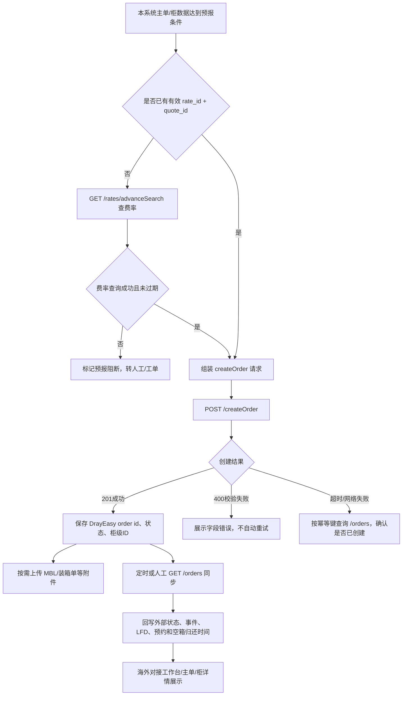

# DrayEasy 柜子预报对接 PRD

> **计划二 #7 附录（全文细则）** · 验收分册：[外部对接 PRD · #s-f7](../旁支计划二-外部对接-PRD.html#s-f7)

> **返回：** [模块导航](模块导航.html) · [计划二模块总览](../旁支计划二-模块导航.html) · [← 旁支计划二导航](../../../产品部门-导航.html#s-branch-connect) · [旁支计划二总册 #7](../../../产品部门-旁支计划二-PRD.html#f7)

> 文档状态：需求草稿，可进入评审；尚不可直接进入开发或测试
> 主要读者：产品、海外对接组、船务、海外仓、前端、后端、测试
> 交付物：本 Markdown PRD
> 资料依据：DrayEasy 官方开发者文档 [Drayage API](https://developers.drayeasy.com/dray)
> 已读取页面：[费率查询](https://developers.drayeasy.com/dray/other/getratesearch.md)、[创建订单](https://developers.drayeasy.com/dray/order/createorder.md)、[订单查询](https://developers.drayeasy.com/dray/order/searchorders.md)、订单附件接口
> 最后更新：2026-09-10

## 1. 先说结论

DrayEasy 文档当前呈现的是 **Drayage（美国港到仓/目的地的拖运）API**，不是典型的海外仓 WMS 入库 API。若本次目标是把“柜子运输/派送数据预报给 DrayEasy”，主接口是：

1. **`POST /createOrder`**：创建一票 DrayEasy 订单，订单内用 `containers` 数组传一个或多个柜子。
2. **`GET /rates/advanceSearch`**：当本系统没有可复用的 DrayEasy 费率快照时，先查费率，取得创建订单必填的 `rate_id` 和 `quote_id`。
3. **`GET /orders`**：按 DrayEasy `order id`、MBL、Booking、柜号或客户参考号查询订单，用于预报后的状态同步。
4. **`POST /orders/{orderId}/files`**：上传 MBL、装箱单、POD、DO 等订单附件（是否本期上传由业务确认）。

当前文档未发现订单更新、取消、回调 Webhook 或“只更新柜子不重建订单”的接口。因此，柜子数据变化后的更新方式是本次对接的 P0 待确认项，不能直接假设为 `PUT /orders`。

## 2. 需求理解

现有系统在主单/柜/运单确认后，需要把柜号、柜型、重量、件数、目的地、预计到港时间和交付信息预报到 DrayEasy，供其安排美国港后拖运、送仓和后续节点追踪。预报成功后，本系统需要保存外部订单号和状态，并把 DrayEasy 返回的订单/柜状态同步回主单、柜和海外对接工作台。

本期只定义“柜子预报与状态同步”的业务契约，不把 DrayEasy 的内部订单状态冒充本系统的运输节点，也不在未确认授权和数据来源前直接改动现有订单数据。

## 3. 本次处理目标

- **目标**：明确需要对接的接口、请求信息、字段来源、回写信息、异常和验收标准。
- **输出模式**：前后端联调评审版草稿。
- **本期范围**：费率查询依赖、创建订单、订单附件、订单查询、柜级状态同步、重复预报防护。
- **本期不做**：不实现 DrayEasy 页面操作；不虚构 API 基础域名、鉴权凭证、Webhook、修改/取消接口；不直接把 DrayEasy 费用写入本系统财务账单。

## 4. 接口清单与调用顺序

| 顺序 | 接口 | 是否必接 | 用途 | 关键依赖 |
| --- | --- | --- | --- | --- |
| 1 | `GET /rates/advanceSearch` | 条件必接 | 查费率并取得 `rate_id`、`quote_id` | 目的地 intermodal region、目的城市、柜型/重量/货类 |
| 2 | `POST /createOrder` | **必接** | 创建 DrayEasy 订单并预报柜子 | bearerAuth；MBL、rate、quote、目的地、containers |
| 3 | `POST /orders/{orderId}/files` | `[待确认]` | 上传 MBL、装箱单、POD 等文件或 URL | DrayEasy orderId、文件类型 |
| 4 | `GET /orders` | **必接** | 按订单/MBL/Booking/柜号查询并同步状态 | 分页；至少保存 DrayEasy orderId |
| 5 | `GET /orders/{orderId}/files` | `[建议]` | 查看已上传文件 | 订单附件审计/下载需求 |
| 6 | `GET /orders/{orderId}/files/{fileId}` | `[建议]` | 下载单个附件 | 文件权限与留存策略 |

### 4.1 业务流程图

图后说明：创建订单是预报主动作；费率查询只是创建订单的前置依赖。创建超时不能盲目再次创建，应先用 MBL、柜号或客户参考号查询，防止重复订单。

## 5. 各接口需要传什么信息

### 5.1 `GET /rates/advanceSearch`：费率查询（条件前置）

**用途**：创建订单要求 `rate_id` 和 `quote_id`。如果本系统已有未过期且匹配的 DrayEasy 费率快照，可直接复用；否则先调用本接口。

| 参数 | 文档要求 | 本系统来源/处理 | 备注 |
| --- | --- | --- | --- |
| `intermodal_region_id` | 必填，Intermodal Region ID | `[待确认]` 目的港/目的地字典映射 | 不是简单文本港名，需保存外部 ID |
| `to_city_id` | 必填，目的城市 ID | `[待确认]` 海外仓/送货城市映射 | 需保存外部城市 ID |
| `cntr_size` | 选填，20/40/45；不传默认 40 | 柜型转换 | 建议必传，避免默认误算 |
| `cargo_types` | 选填，2=危险品，3=冷藏；空=普货 | `is_dg`、`is_reefer` | 多值数组；映射需确认危险品/冷藏组合 |
| `weight` | 选填，柜重 | `containers.weight` | 需要统一 KG/LB；建议统一 KG 后按接口要求转换 |
| `weight_unit` | 选填，仅 `lb`/`kg` | 系统单位配置 | 不允许传其他单位 |
| `cargo_value` | 选填，0～1,000,000 | 货值字段 | 超范围前置拦截 |
| `is_limited_area_access` | 选填，限制区域 | 目的地/客户配置 | 来源和维护方 `[待确认]` |

**响应中必须保存**：`quote_id`、`rates.id`（即 `rate_id`）、币种、基础费、燃油附加费、拖车费、有效期 `expired_at`、适用终端及场景。创建订单时使用的费率必须保存快照，不能只保存当前查询结果。

### 5.2 `POST /createOrder`：柜子预报主接口

#### 订单级字段

| 字段 | 文档要求 | 本系统建议来源 | 必填/规则 |
| --- | --- | --- | --- |
| `mbl_number` | MBL 主提单号 | 主单主数据 | **必填**；作为跨系统关联键之一 |
| `rate_id` | 费率 ID | 费率查询响应/已保存快照 | **必填**；传 `rates.id` |
| `quote_id` | 费率报价 ID | 费率查询响应 | **必填**；不能临时编造 |
| `destination_type` | 1=Ocean Port，2=Ramp Port | 目的地类型 | 默认 1；Ramp Port 时需最终港信息 |
| `live_or_drop` | 0 未知、1 Live、2 Drop | 装卸方式/客户要求 | 默认 0；业务口径 `[待确认]` |
| `port_of_discharge_id` | POD Intermodal Region ID | 外部港口字典映射 | **必填**；不是 UN/LOCODE 文本 |
| `port_of_discharge_eta` | POD ETA | 主单 ETA/船期 | **必填**；日期格式以接口示例为准，时区 `[待确认]` |
| `final_port_id` | Final Port Intermodal Region ID | 目的港/铁路节点字典 | `destination_type=2` 时必填 |
| `final_port_eta` | Final Port ETA | 运输计划 | Ramp Port 时必填 |
| `warehouse_id` | DrayEasy Warehouse ID | `[待确认]` 外部仓库映射表 | 与 `delivery_address` 二选一；地址为空时必填 |
| `delivery_address` | 最终交付地址 | 海外仓/客户地址 | 与 `warehouse_id` 二选一；需保留版本 |
| `pu_number_agent_id` | Pickup Number Agent ID | `[待确认]` 外部代理映射 | 选填；不可传本系统名称代替 ID |
| `customer_reference_number` | 客户参考号 | 本系统客户单号/主单业务号 | **必填**；需确认唯一性口径 |
| `customer_memo` | 客户备注 | 客户/业务备注 | 选填；敏感信息过滤 `[待确认]` |
| `terminal_firms_code` | 码头 FIRMS Code | 码头/卸货港字典 | 选填；需确认来源 |
| `urgent` | 是否加急 | 业务优先级 | 默认 false |
| `contact_emails` | 联系邮箱数组 | 客服/海外仓联系人 | 选填；邮箱校验 |
| `containers` | 柜子数组 | 本系统柜明细 | **必填且至少一个** |

#### `containers` 柜级字段

| 字段 | 文档要求 | 本系统建议来源 | 必填/规则 |
| --- | --- | --- | --- |
| `number` | 四字母+七数字柜号 | 柜主数据 | **必填**；校验 ISO 柜号格式 |
| `type` | 20GP/40HQ 等枚举 | 柜型字典 | **必填**；40HQ/40HC 等映射需产品确认 |
| `seal_number` | 封条号 | 柜/装柜信息 | 选填；空值不能传“—” |
| `package` | 如 `20 Cartons` | 货物件数+包装单位 | **必填**；文档是字符串，不是单独数值字段 |
| `weight` | KG 重量 | 柜毛重/实际重量 | **必填**；单位固定 KG，来源与精度待确认 |
| `delivery_reference` | 交付参考号 | 海外仓预约/客户参考 | 选填 |
| `is_dg` | 危险品 | 货物合规字段 | 默认 false；与附件 DG form 联动 |
| `is_soc` | SOC 自备箱 | 柜属性 | 默认 false |
| `is_overweight` | 超重 | 重量规则计算 | 默认 false；阈值 `[待确认]`，不能仅凭人工备注 |
| `is_reefer` | 冷藏柜 | 柜型/货物属性 | 默认 false；与 `type`/费率货类一致 |
| `commodity` | 品名数组 | 货物明细聚合 | 选填；多品名拆分和长度限制待确认 |
| `loading_type` | 0 未定、1 打托、2 地板装、3 其他 | 装柜方式 | 选填；本系统枚举需映射 |
| `cargo_value` | 货值 0～1,000,000 | 货物/保险资料 | 选填；超范围拦截 |

#### 文件字段

`file_list` 可上传文件列表。文档要求文件最大 10M，文件类型包括 `DO`、`DG form`、`POD`、`Packing List`、`MBL`、`Telex`、`PU#`、`MSDS`、`Payment Proof`、`Scale Ticket`、`Ingate EIR`、`Arrival Notice`、`Vendor Invoice` 等。

`[建议]` 首期至少支持：`MBL`、`Packing List`、`DG form`（危险品时）、`MSDS`（适用时）；POD、空箱回收证明等在后续节点产生后通过附件接口补传。

### 5.3 `GET /orders`：查询与状态同步

支持的查询条件：`id`、`mbl_number`、`booking_number`、`container_number`、`customer_reference_number`、`page`、`per_page`。

**推荐同步策略**：优先用本地保存的 DrayEasy order id 查询；没有 order id 时用 MBL 或柜号查询。创建超时后，必须先查询再决定是否重建。

本系统重点接收并保存：订单 `id`、MBL、Booking、DrayEasy `status`、`released_status`、目的地、金额摘要、柜列表、柜状态、事件轨迹、LFD、预约时间、放货/清关/码头放行时间、实际送达时间和空箱归还时间。

### 5.4 订单附件接口

- `POST /orders/{orderId}/files`：上传文件或 URL；需要明确是本系统文件流还是外链 URL。
- `GET /orders/{orderId}/files`：查询订单附件。
- `GET /orders/{orderId}/files/{fileId}`：下载单个文件。

`[待确认]` 当前文档没有说明文件上传的鉴权、multipart 字段完整示例、重复文件覆盖规则、病毒扫描和保存期限，联调前需补齐。

## 6. DrayEasy 状态回写

### 6.1 订单状态

文档提供的订单状态为：`open` 新订单、`on hold` 暂停、`in review` 审核中、`confirmed` 已确认、`dispatched` 已派发、`in progress` 处理中、`delivered` 已送达、`empty returned` 已还空、`closed` 已关闭、`canceled` 已取消。

`[建议]` 本系统保留外部原始状态，同时归一化为“预报中、待确认、执行中、已送达、已还空、已关闭、已取消、异常”，不覆盖现有海运实际节点。

### 6.2 柜状态

文档提供柜级状态码：`-5` Canceled、`0` Order Confirmed、`1` Predelivery Appointment sent、`2` Predelivery Appointment confirmed、`8` Exam DO received、`30` Delivery plan Set、`34` Available、`36` CET Exam site pickup Apt confirmed、`38` Prepull to yard、`41` Deliver to Destination、`42` Container Dropped to Destination、`44` CNTR Emptied informed from WHS、`46` Empty Returned to terminal/depot、`50` MET Exam site pickup Apt confirmed、`55` WHS Apt Made by Customer、`56` Outgated、`61` WHS Apt Confirmed(MET)。

页面展示至少要有：外部编码、英文原文、中文解释、更新时间、来源“DrayEasy”、所属柜号。`[待确认]` 这些柜状态与本系统“提柜、送仓、签收、还空”等节点的最终映射，不能仅按英文名称直接覆盖。

### 6.3 事件与时间字段

柜返回 `shipping_events`，事件活动包括 `GATE-OUT-EMPTY`、`GATE-IN`、`LOAD`、`DISCHARG`、`GATE-OUT`、`EMPTY-RETURNED`，并带时间、船名、航次、地点。另有 LFD、预约提柜、预约送仓、放货、清关放行、码头放行、实际送达、实际还空等时间字段。

本系统须保存原始时间、事件类型、地点、船名/航次、外部更新时间和抓取时间；时间时区及显示格式 `[待确认]`。

## 7. 本系统对象与字段落位

| 本系统对象 | 对接信息 | 保存要求 |
| --- | --- | --- |
| 主单/提单 | `mbl_number`、POD ETA、目的港、客户参考号 | 保存 DrayEasy order id 和请求版本 |
| 柜 | `containers.number/type/seal_number/weight/package`、柜状态、事件 | 一柜一条外部关联；多柜订单按柜号拆分 |
| 送仓任务 | `warehouse_id` 或 `delivery_address`、预约/送达信息 | 外部仓库 ID 与本系统海外仓 ID 建映射 |
| 费率快照 | `rate_id`、`quote_id`、币种、费用、有效期 | 创建订单时锁定使用的快照 |
| 附件 | 文件类型、文件名、外部 fileId、URL | 关联主单/订单/柜；下载权限留痕 |
| 对接日志 | 请求摘要、响应摘要、状态码、重试次数 | 脱敏保存，不记录 bearer token |

### 7.1 预报唯一键与重复防护

`[建议]` 本系统生成业务幂等键：`客户 + mbl_number + 柜号集合版本 + 目的地版本`。真正发送前先查询本地是否已有成功的 DrayEasy order id；网络超时后先调用 `GET /orders`，不得直接再次 `POST /createOrder`。

`[待确认]` DrayEasy 是否允许同一个 MBL 创建多个订单、是否以 `mbl_number` 或 `customer_reference_number` 做唯一校验，需以正式环境行为或供应商确认结果为准。

## 8. 前端页面与交互

### 8.1 主单/柜详情增加“DrayEasy 预报”卡片

- 展示：预报状态、DrayEasy order id、MBL、关联柜数、最近同步时间、最近错误。
- 操作：查询费率、创建预报、补传附件、立即同步、查看原始响应、转工单。
- 创建前展示校验摘要：缺 MBL、缺 rate/quote、缺 POD ID/ETA、缺 warehouse_id/地址、柜号格式错误、重量/件数缺失。
- 多柜订单显示每个柜的外部柜 ID、柜状态和最近事件。
- 任何外部状态必须带来源标签“DrayEasy”，与本系统实际节点分开展示。

### 8.2 失败提示

- 400 校验失败：按字段展示 `errors`，不自动重试。
- 401 未授权：提示凭证/Token 失效，转系统管理员，不展示密钥。
- 网络超时：显示“正在确认是否已创建”，先查询后允许重试。
- 费率过期：要求重新查询费率，不使用过期 `rate_id/quote_id`。
- 仓库/目的地 ID 未映射：阻止发送，并提供“维护外部映射”入口 `[待确认]`。

## 9. 权限、审计与安全

| 角色 | 查看预报 | 创建/重试 | 传附件 | 修改映射 | 查看原始报文 |
| --- | --- | --- | --- | --- | --- |
| 船务/海外对接组 | 是 | `[待确认]` | `[建议]` | 否 | 脱敏查看 |
| 港后客服 | 关联业务范围 | `[建议]`仅手动重试 | 是 | 否 | 否 |
| 海外仓 | 关联任务 | 否 | `[待确认]` | 否 | 否 |
| 管理员 | 是 | 是 | 是 | 是 | 是 |

每次查费率、创建、重试、附件上传、手工同步、映射修改和人工覆盖都记录操作人、时间、业务对象、请求版本、响应状态和原因。Bearer Token、客户端密钥及文件内容不得进入普通日志。

## 10. 异常与恢复

| 编号 | 场景 | 系统处理 | 用户看到什么 |
| --- | --- | --- | --- |
| EX-DE-001 | rate/quote 缺失或过期 | 阻止创建，先查费率 | “请先获取有效费率” |
| EX-DE-002 | 同一柜已成功预报 | 打开已有订单，不重复创建 | “已存在 DrayEasy 订单” |
| EX-DE-003 | 创建请求超时 | 先按 MBL/柜号查询，确认是否已创建 | “正在确认外部订单结果” |
| EX-DE-004 | 400 字段校验失败 | 保存 errors，定位到字段 | “DrayEasy 校验失败：…” |
| EX-DE-005 | 401 | 标记授权异常，暂停自动发送 | “对接授权失效，请管理员处理” |
| EX-DE-006 | warehouse_id 与 delivery_address 都为空 | 阻止创建 | “需选择外部仓库或填写交付地址” |
| EX-DE-007 | 多柜中单个柜号/柜型无效 | 整单不发送，展示具体柜行 | “第 N 个柜信息不完整” |
| EX-DE-008 | 外部订单已创建但附件上传失败 | 订单保持已创建，附件单独待重试 | “订单已预报，附件未上传” |
| EX-DE-009 | 查询接口返回分页数据 | 按 page/per_page 拉取完整页并去重 | “已同步 N 条” |
| EX-DE-010 | 外部状态与本地节点冲突 | 并列展示并记录来源，不静默覆盖 | “外部状态与本地节点不一致” |

## 11. 验收标准

- **AC-DE-001** Given 主单有 MBL、POD 外部 ID、ETA、目的地、有效 rate_id/quote_id 和至少一个合法柜；When 点击创建预报；Then 系统调用 `POST /createOrder`，保存 DrayEasy order id、外部状态和每个柜的关联结果。
- **AC-DE-002** Given 本地没有有效费率快照；When 用户发起预报；Then 系统先调用 `GET /rates/advanceSearch`，成功后才允许创建订单，并保存 `rate_id`、`quote_id` 和有效期。
- **AC-DE-003** Given 一个订单包含两个柜；When DrayEasy 返回订单；Then 本系统按柜号分别保存柜状态和事件，但主单只关联一个 DrayEasy order id。
- **AC-DE-004** Given `destination_type=2`；When 用户提交且缺 `final_port_id` 或 `final_port_eta`；Then 前后端均阻止调用创建接口，并定位缺失字段。
- **AC-DE-005** Given `warehouse_id` 和 `delivery_address` 均为空；When 用户提交；Then 系统不调用外部接口并提示必须选择仓库或填写地址。
- **AC-DE-006** Given 创建请求网络超时；When 系统恢复；Then 先用 MBL/柜号查询外部订单，确认无订单后才允许再次创建。
- **AC-DE-007** Given DrayEasy 返回 400 且包含 `errors`；When 用户查看结果；Then 页面按字段展示错误，不把该请求标记为已预报。
- **AC-DE-008** Given DrayEasy 订单已创建但附件上传失败；When 用户查看详情；Then 订单状态仍为已创建，附件状态单独显示待重试，不重复创建订单。
- **AC-DE-009** Given `GET /orders` 返回 `delivered` 或 `empty returned`；When 定时同步；Then 本系统保存外部原始状态和更新时间，按确认后的映射更新对应业务视图。
- **AC-DE-010** Given DrayEasy 返回柜事件 `EMPTY-RETURNED`；When 系统保存事件；Then 事件时间线显示柜号、事件、地点、来源和抓取时间，不直接覆盖本系统实际还空节点，除非业务规则已确认。

## 12. P0/P1 待确认项

| 编号 | 级别 | 问题 | 不确认的影响 | 推荐方案 |
| --- | --- | --- | --- | --- |
| Q-DE-001 | P0 | 该文档是否确实是本次要对接的海外仓/拖车平台？ | DrayEasy API 只有美国拖运订单能力，可能不是 WMS 入库预报 | 先由海外仓确认目标系统和业务场景；若是港到仓拖运，继续使用本方案 |
| Q-DE-002 | P0 | 正式 API 基础域名、测试环境、Bearer Token 获取方式和 IP 白名单是什么？ | 无法联调 | 由 DrayEasy 提供正式/测试配置和凭证交付方式 |
| Q-DE-003 | P0 | `warehouse_id`、`intermodal_region_id`、`to_city_id`、`pu_number_agent_id` 的映射表由谁维护？ | 不能把本系统名称直接传给外部 ID 字段 | 建立外部字典映射，保存版本和失效日期 |
| Q-DE-004 | P0 | 柜子信息变更、订单取消、换目的地是否有更新/取消接口？ | 首次预报后无法安全修正，可能重复下单 | 向供应商确认更新/取消能力；未确认前只允许查询和人工处理 |
| Q-DE-005 | P0 | 费率是否必须每次重新查询，`quote_id` 有效期和可复用范围是什么？ | 可能使用过期报价或产生费用差异 | 保存费率快照并在 `expired_at` 前复用，过期重新查 |
| Q-DE-006 | P0 | 同一 MBL/柜号的外部唯一性和重复订单规则是什么？ | 超时重试可能创建重复订单 | 以本地幂等键 + 外部查询双重防重 |
| Q-DE-007 | P1 | 是否需要上传 MBL、装箱单、DG/MSDS、POD，附件格式/权限/留存多久？ | 影响资料完整性和存储 | 首期支持 MBL、Packing List；危险品按条件上传 DG/MSDS |
| Q-DE-008 | P1 | DrayEasy 是否提供 Webhook？若没有，查询频率、限流和夜间策略是什么？ | 状态同步可能延迟或触发限流 | 默认定时轮询 + 手动同步，频率待供应商确认 |
| Q-DE-009 | P1 | DrayEasy 费用是否仅展示，还是进入本系统应付/客户结算？ | 可能误记账 | 首期只保存外部金额摘要，不自动入账 |
| Q-DE-010 | P2 | 外部状态中文文案和客服通知是否需要统一？ | 影响页面和通知体验 | 保留英文原文，产品确认后维护中文字典 |

## 13. 就绪状态与下一步

- 当前状态：**可进入评审**，但存在 Q-DE-001～Q-DE-006 六个 P0，暂不可直接进入开发。
- 第一优先级是确认“这是否为目标海外仓接口”以及更新/取消、认证、外部 ID 映射、费率和幂等规则。
- 确认后可拆出：前端字段与交互清单、后端接口契约与回写模型、测试用例和联调数据模板。
- 建议使用 3 个脱敏案例验收：单柜普货 40HQ、多柜且含危险品、创建超时后查询确认；另加一个地址/目的地变更案例验证更新边界。
