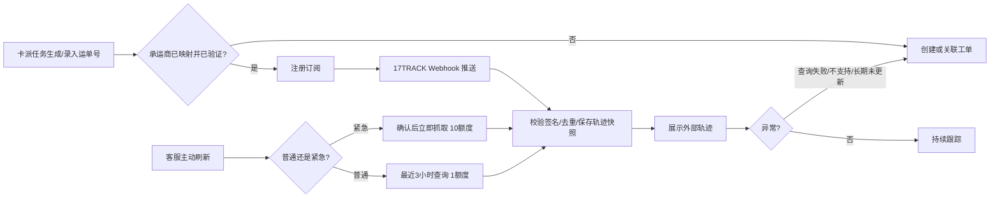

# 17TRACK 卡车派送轨迹对接方案 PRD

> **计划二 #8 附录（全文细则）** · 验收分册：[外部对接 PRD · #s-f8](../旁支计划二-外部对接-PRD.html#s-f8)

> **返回：** [模块导航](模块导航.html) · [计划二模块总览](../旁支计划二-模块导航.html) · [← 旁支计划二导航](../../../产品部门-导航.html#s-branch-connect) · [旁支计划二总册 #8](../../../产品部门-旁支计划二-PRD.html#f8)

> 文档状态：可进入评审的需求草稿；其中第三方实际字段、承运商覆盖范围和授权参数仍待联调确认。  
> 主要读者：产品、海外对接组、后端、前端、客服/异常处理岗。  
> 本期目标：让已支持的美国卡派承运商能在系统内查询、订阅并展示轨迹；异常自动沉淀为可处理的工单。  
> 信息依据：17TRACK v2.4 文档、17TRACK 技术支持群聊（1 月 9 日）、现有工单方案。  
> 本期不做：自建卡车轨迹采集、把 17TRACK 轨迹直接当成我司实际操作节点、未经确认直接财务计费。

## 一、先回答已提出的问题

### 1. 17TRACK 是否有“卡派专用接口”？

[已确认] 没有独立的卡派/卡车轨迹接口。17TRACK 的答复是：已支持的美国卡车承运商，按“小包运输商”的方式接入和查询，推送的数据结构也与小包一致。

因此，本系统不应新增一套“卡派专用协议”。对已支持承运商，统一走 17TRACK 的运单注册、轨迹查询、实时查询和轨迹推送能力；页面文案显示为“卡派轨迹（17TRACK）”。

### 2. 哪些美国卡派服务商可以查？

[已确认] 运输商支持范围持续变化，17TRACK 每周会新增一批运输商；不能把截图或静态名单当长期标准。

- 最新清单：<https://res.17track.net/asset/carrier/info/apicarrier.all.json>
- 下载清单：<https://res.17track.net/asset/carrier/info/apicarrier.all.csv>

[建议] 上线前由海外对接组用当前美国卡派承运商名称、官网、真实单号逐一做支持性验证，形成“我司承运商映射表”。未验证或未支持的承运商必须显示“待评估”，不能显示“可追踪”。

### 3. 实时查询要先订阅单号吗？

[已确认] 不需要。17TRACK 已明确：实时查询不需要先订阅单号，但需单独申请授权；群聊中已确认 `luhuiheng@txgjfba.com` 的实时接口授权已开通。

### 4. 实时查询有什么费用和使用建议？

[已确认] 两种扣费方式：

| 调用方式 | 返回口径 | 单次额度 | 本期建议 |
| --- | --- | ---: | --- |
| 最近 3 小时轨迹 | 返回最近已抓取的轨迹 | 1 | 客服主动刷新默认使用 |
| 立即抓取最新轨迹 | 触发立即向承运商抓取 | 10 | 仅紧急场景使用 |

[建议] 常规自动跟踪用“注册订阅 + Webhook 推送”，不高频轮询。紧急立即抓取要二次确认，记录操作人、原因和消耗额度，并对同一运单限频；额度预算由业务负责人确认。

### 5. 不支持的卡车承运商怎么办？

[已确认] 提交承运商官网与真实单号给 17TRACK，由其产品研发评估能否按小包运输商接入。

[建议] 系统工单自动带出“承运商名称、官网、单号、目的国、最后已知节点、客户紧急程度”，状态为“待 17TRACK 评估”；期间不伪造轨迹，也不覆盖卡派任务状态。

## 二、范围与主流程

### 2.1 本期范围

- 为卡派任务/运单保存 17TRACK 承运商编码、运单号、订阅状态和最新轨迹快照。
- 注册轨迹订阅，接收并校验轨迹更新通知，展示完整节点。
- 支持人工刷新：默认最近 3 小时；紧急立即抓取需确认。
- 对“未支持、注册/查询失败、长时间未更新”创建或关联工单。
- 将海外仓费用和卡派轨迹在同一关联对象下展示，但费用不因轨迹自动入账。

### 2.2 本期不做

- 不承诺所有美国卡派商都可查。
- 不把 17TRACK 的签收/运输状态直接更新为我司“已签收/已结案”。业务人员确认或已有业务回传才可变更业务实际状态。
- 不做真实财务入账、应收应付生成、付款、锁账和核销。

### 2.3 主流程

大白话：正常情况系统订阅一次，后续等 17TRACK 把变化推过来；客服需要确认时才手动查询。轨迹只是一条外部证据，不能替代仓库、承运商或业务人员对实际业务节点的确认。

## 三、对接能力与业务契约

### 3.1 需要使用的 17TRACK 能力

| 业务动作 | 文档接口 | 本系统用途 | 关键输入 | 关键结果 |
| --- | --- | --- | --- | --- |
| 注册订阅 | `POST /track/v2.4/register` | 让系统后续收到轨迹更新 | `number`、`carrier` | 注册结果、订阅标识/失败原因 |
| 修改承运商 | `POST /track/v2.4/changecarrier` | 纠正识别错误 | 单号、承运商编码 | 修改结果 |
| 查询已订阅轨迹 | `POST /track/v2.4/gettrackinfo` | 详情页补查/展示 | 单号、承运商编码 | 轨迹节点、运输状态、更新时间 |
| 实时查询 | `POST /track/v2.4/getRealTimeTrackInfo` | 客服主动刷新 | 单号、承运商编码、查询模式 | 最新轨迹及调用结果 |
| Webhook | `POST /track/v2.4/push`（17TRACK 向我方回调） | 自动更新轨迹 | 事件、单号、承运商、标签 | 保存结果、处理日志 |
| 查询额度 | `POST /track/v2.4/getquota` | 额度预警 | 授权信息 | 可用额度 |

注：上表是产品所需的业务能力，具体 API 路径、认证 Header、批量上限及返回字段必须以 17TRACK 实际账号文档和联调结果为准。

### 3.2 最小字段

| 字段 | 所属对象 | 来源/维护方 | 本期规则 |
| --- | --- | --- | --- |
| 卡派运单号 `number` | 卡派任务/运单 | 业务录入或承运商回传 | 必填；去空格；需保留原值 |
| 17TRACK 承运商编码 `carrier` | 承运商映射 | 17TRACK 清单 + 海外对接组维护 | 已验证后才允许自动注册 |
| 业务承运商名称/官网 | 卡派任务 | 业务主数据/人工补充 | 未支持反馈工单必填官网 |
| 标签 `tag` | 订阅记录 | 我方系统生成 | 建议存卡派任务唯一标识，方便回调归属 |
| 订阅状态 | 订阅记录 | 17TRACK 返回 + 系统计算 | 待注册、已订阅、失败、停止 |
| 最新外部节点 | 轨迹快照 | 17TRACK 回调/查询 | 节点时间、地点、描述、原始状态、抓取时间 |
| 最新外部轨迹状态 | 轨迹快照 | 17TRACK | 与我司业务状态分开保存 |
| 最后成功更新时间 | 轨迹快照 | 17TRACK | 用于“长期未更新”预警 |
| 查询类型/额度 | 查询日志 | 系统 | 最近3小时=1、立即抓取=10，实际扣费以供应商账单为准 |

### 3.3 关键规则

- **BR-17-001**：[已确认] 卡派没有独立接口。所有已支持承运商按 17TRACK 小包运输商结构对接。
- **BR-17-002**：[建议] 自动注册仅面向“承运商映射有效 + 已验证”的任务；没有映射时生成待评估工单或人工补充，不盲目调用。
- **BR-17-003**：[建议] 单号、承运商编码、业务对象唯一标识组合幂等；重复注册不新增重复订阅记录。
- **BR-17-004**：[建议] Webhook 到达后校验签名。根据公开文档说明，使用“原始通知报文 + `/` + 密钥”计算 SHA256，与通知中的 `sign` 比较；签名不通过不写业务数据并告警。
- **BR-17-005**：[建议] 回调事件按事件 ID；若无事件 ID，则按“单号 + 承运商 + 节点时间 + 节点描述”去重。原始报文留存，方便排查乱序/重复通知。
- **BR-17-006**：[建议] 外部轨迹可新增、重复或乱序；页面按节点发生时间排序并标明“来自 17TRACK”。不得把外部节点直接覆盖我司实际提柜、出库、签收等业务节点。
- **BR-17-007**：[已确认] 普通实时查询消耗 1 额度，立即抓取消耗 10 额度。紧急模式需二次确认和限频。[待确认] 同单冷却时长与月度额度预算。
- **BR-17-008**：[建议] 轨迹正常更新不建工单；“承运商未支持、注册/查询连续失败、达到业务设定阈值仍无更新”才创建或复用异常工单。

## 四、页面与工单联动

### 4.1 卡派任务/运单详情

展示：承运商、17TRACK 支持状态、订阅状态、最近外部节点、最后更新时间、刷新按钮、额度提示、完整轨迹、原始外部状态。

刷新按钮：

- “刷新最近轨迹”：默认动作，消耗 1 额度；无二次确认。
- “立即抓取最新轨迹”：展示“将消耗 10 额度”的确认框，确认后调用；失败不更改已有快照。

### 4.2 工单自动联动

| 触发 | 工单类型/标签 | 自动带入信息 | 结案条件 |
| --- | --- | --- | --- |
| 承运商未支持 | 卡派轨迹·待评估 | 承运商、官网、单号、国家、真实样本单号 | 17TRACK确认支持/不支持或改为人工跟踪 |
| 注册/查询失败 | 卡派轨迹·对接异常 | 错误码、错误信息、调用时间、重试次数 | 重试成功或人工关闭并说明原因 |
| 长时间不更新 | 卡派轨迹·异常跟进 | 最后节点、最后更新时间、客户承诺时效 | 查明原因并记录业务结果 |
| 轨迹有更新 | 不创建工单 | 节点快照、来源、抓取时间 | 不适用 |

[待确认] “长时间不更新”的阈值必须按承运商/服务类型/在途阶段配置，不能所有卡派单统一按固定小时数判断。

## 五、费用与财务预留

[已确认] 海外仓已能返回费用，一期可以接收费用回传并在工单中展示、由业务确认；不做真实财务入账。

一期费用快照字段：外部费用 ID、版本、费用名称、原币种、原币金额、数量、单位、发生时间、关联柜/运单、附件、业务确认结果。费用调整必须新建版本，不覆盖旧快照。

二期预留但不启用：费用方向、费用项映射、核算主体、汇率、税额、财务同步状态和财务草稿号。只有“已业务确认且未撤销”的费用快照才能供财务消费。

## 六、待确认与就绪度

| 编号 | 级别 | 待确认项 | 影响 |
| --- | --- | --- | --- |
| Q17-01 | P0 | 当前美国卡派承运商清单、官网、真实测试单号及 17TRACK 覆盖验证结果 | 无法确定可自动订阅范围 |
| Q17-02 | P0 | API Token、Webhook 地址、签名密钥、生产/测试环境与批量限制 | 无法真实联调 |
| Q17-03 | P0 | 17TRACK 外部状态与我司卡派/运单业务状态的映射边界 | 防止错误推进业务节点 |
| Q17-04 | P1 | 最近3小时/立即抓取的同单限频与月额度预算 | 控制成本 |
| Q17-05 | P1 | 长时间无更新预警阈值及升级人 | 自动建单口径 |
| Q17-06 | P1 | 谁维护承运商映射与失效/新增审核 | 支持范围持续变化 |

角色就绪度：前端可按“外部轨迹展示、刷新确认、待评估提示、工单标签”做演示开发；后端和真实联调仍被 Q17-01~03 阻塞；测试可先准备签名、重复通知、乱序节点、额度提示、未支持承运商等模拟用例。
