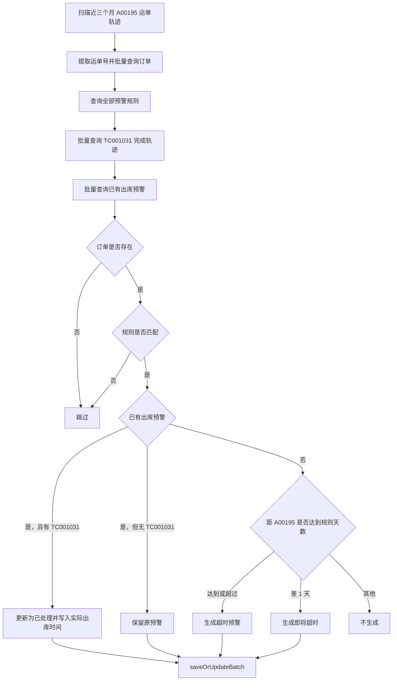
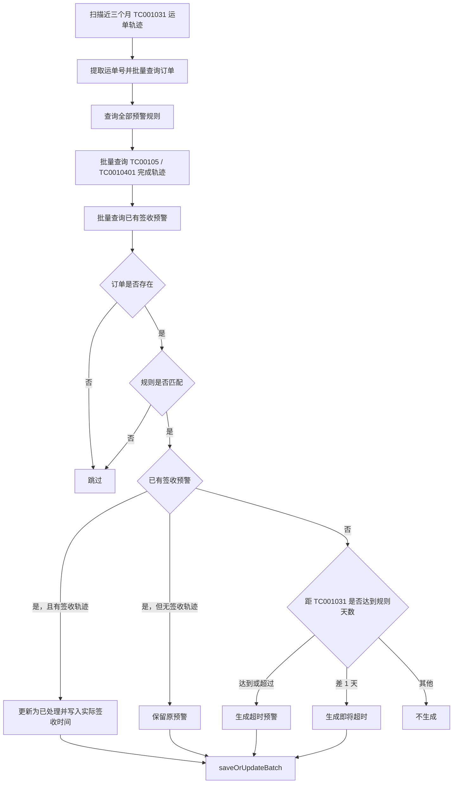

# 运单预警任务逻辑说明

## 1. 任务入口

运单预警任务入口在 `tx-job` 模块：

- 定时任务类：`com.yykj.job.task.warning.OrderWarningJob`
- 任务方法：`execution(String threadNo)`
- 服务实现：`com.yykj.job.buss.service.impl.BussOrderWarningServiceImpl`
- 手动触发接口：
  - `GET /bussOrderWarning/outboundWarningData`
  - `GET /bussOrderWarning/signWarningData`

`OrderWarningJob.execution` 执行时按固定顺序调用：

1. `bussOrderWarningService.outboundWarningData()`：生成或更新出库预警。
2. `bussOrderWarningService.signWarningData()`：生成或更新签收预警。

预警记录落表：`S_BUSS_ORDER_WARNING`。

预警规则来源表：`S_BUSS_ORDER_WARNING_RULE`。

轨迹来源表：`S_BUSS_ORDER_TRACK`。

## 2. 关键轨迹编号

| 轨迹编号 | 当前逻辑中的作用 | 说明 |
| --- | --- | --- |
| `A00195` | 出库预警的起点轨迹 | 代码注释和其他模块引用显示为提柜相关轨迹。 |
| `TC001031` | 出库预警的完成轨迹，也是签收预警的起点轨迹 | 其他模块中用于“私卡出发登记”。 |
| `TC00105` | 签收预警的完成轨迹之一 | 其他模块中用于“私卡派上传POD签收”。 |
| `TC0010401` | 签收预警的完成轨迹之一 | 当前预警逻辑将其与 `TC00105` 一起视为签收完成类轨迹。 |

## 3. 公共处理逻辑

两个方法的主流程基本一致，差异在起点轨迹、完成轨迹和预警类型。

### 3.1 分页扫描轨迹

每页处理 `5000` 条轨迹，通过 `PageHelper.startPage(currentPage, pageSize)` 分页。

公共过滤条件：

- `TRACK_TYPE = '运单'`
- `CREATE_TIME > LocalDate.now().minusMonths(3)`
- `BILL_NO_SUB IS NULL`

说明：这里只处理主运单轨迹，不处理子单轨迹。

### 3.2 批量补充订单信息

从当前页轨迹中提取不重复的 `BILL_NO`，每 `1000` 个运单号一批调用 `bussOrderService.getList(batch)`。

订单查询会关联多张表，预警逻辑实际使用的字段主要包括：

| 字段 | 来源含义 | 用途 |
| --- | --- | --- |
| `billNo` | 运单号 | 预警主键业务维度。 |
| `productNo` | 销售产品 | 匹配预警规则，写入预警记录。 |
| `recipientCountry` | 收件国家 | 写入目的国。 |
| `recipientZipcode` | 收件邮编 | 匹配规则邮编前缀，写入邮编。 |
| `ownerSalesmanName` | 业务员名称 | 写入 `CUSTOMER_SALESMAN`。 |
| `customerAbbreviation` | 客户简称 | 写入 `CUSTOMER_ABBREVIATION`。 |
| `overseasCustomerName` | 海外客服名称 | 写入 `OVERSEAS_CUSTOMER_NO`。 |

如果轨迹对应的订单查不到，则跳过该运单。

### 3.3 匹配预警规则

规则表：`S_BUSS_ORDER_WARNING_RULE`。

当前实现每页都会查询全部规则，再按订单过滤：

1. 如果规则配置了 `PRODUCT_NO`，则必须等于订单 `productNo`。
2. 如果订单有 `recipientZipcode`，则取订单邮编从第 1 位开始、长度等于规则 `postcode.length()` 的前缀，与规则 `POSTCODE` 比较。
3. 如果订单没有邮编，则当前实现会直接认为邮编条件通过。

规则中的时间字段含义：

| 规则字段 | 当前用途 |
| --- | --- |
| `ACTUAL_OUT_PLAN_TIME_COUNT` | 作为出库预警和签收预警的触发天数阈值；同时用于计算预计出库时间。 |
| `EXPECTED_SIGN_TIME_COUNT` | 在预计出库时间基础上继续加天数，得到预计签收时间。 |

### 3.4 查询已有预警

按当前页运单号和预警类型批量查询 `S_BUSS_ORDER_WARNING`：

- 出库预警：`TYPE = '出库预警'`
- 签收预警：`TYPE = '签收预警'`

查询结果转为 `Map<billNo, BussOrderWarning>`。如果同一运单同一类型有多条预警，当前实现保留第一条。

### 3.5 新增或更新预警

每个命中规则的运单都会调用 `processWarning(...)`。

如果返回预警对象，则加入批量保存列表，最后调用 `saveOrUpdateBatch(warningsToSave)`。

生成状态：

- `daysBetween >= ACTUAL_OUT_PLAN_TIME_COUNT`：生成 `超时预警`
- `daysBetween == ACTUAL_OUT_PLAN_TIME_COUNT - 1`：生成 `即将超时`
- 其他情况：不生成

`daysBetween` 的计算方式：

```java
ChronoUnit.DAYS.between(起点轨迹的 TRACK_TIME, LocalDateTime.now())
```

## 4. outboundWarningData 出库预警逻辑

### 4.1 查询范围

出库预警扫描近三个月内的 `A00195` 运单轨迹：

- `TRACK_NO = 'A00195'`
- `TRACK_TYPE = '运单'`
- `CREATE_TIME > 当前日期 - 3个月`
- `BILL_NO_SUB IS NULL`

如果当前页没有数据，方法直接返回失败：`近三个月内没有A00195轨迹数据`。

### 4.2 完成轨迹判断

对当前页运单批量查询 `TC001031` 轨迹。

在 `processWarning` 中：

- 如果已有 `出库预警` 记录，并且该运单存在 `TC001031` 轨迹：
  - 状态更新为 `已处理`
  - `ACTUAL_OUT_PLAN_TIME` 更新为 `TC001031.TRACK_TIME`
  - `UPDATE_TIME` 更新为当前时间
- 如果已有 `出库预警` 记录，但没有 `TC001031`：
  - 直接返回原预警对象，参与 `saveOrUpdateBatch`
  - 状态和实际出库时间不变
- 如果没有已有预警：
  - 根据 `A00195.TRACK_TIME` 与当前时间的天数差判断是否生成新预警

### 4.3 新预警字段

出库预警新建时字段映射：

| 预警字段 | 赋值逻辑 |
| --- | --- |
| `BILL_NO` | `A00195` 轨迹的运单号 |
| `TYPE` | `出库预警` |
| `PRODUCT_NO` | 订单销售产品 |
| `CUSTOMER_SALESMAN` | 订单业务员名称 |
| `CUSTOMER_ABBREVIATION` | 客户简称 |
| `DESTINATION_COUNTRY` | 收件国家 |
| `POSTCODE` | 收件邮编 |
| `PICK_TIME` | `A00195.TRACK_TIME` |
| `EXPECTED_OUT_PLAN_TIME` | `PICK_TIME + ACTUAL_OUT_PLAN_TIME_COUNT` 天 |
| `EXPECTED_SIGN_TIME` | `EXPECTED_OUT_PLAN_TIME + EXPECTED_SIGN_TIME_COUNT` 天 |
| `OVERSEAS_CUSTOMER_NO` | 海外客服名称 |
| `STATUS` | `超时预警` 或 `即将超时` |
| `CREATE_TIME` | 当前时间 |
| `UPDATE_TIME` | 当前时间 |

### 4.4 出库预警流程图



## 5. signWarningData 签收预警逻辑

### 5.1 查询范围

签收预警扫描近三个月内的 `TC001031` 运单轨迹：

- `TRACK_NO = 'TC001031'`
- `TRACK_TYPE = '运单'`
- `CREATE_TIME > 当前日期 - 3个月`
- `BILL_NO_SUB IS NULL`

如果当前页没有数据，方法直接返回失败：`近三个月内没有TC001031轨迹数据`。

### 5.2 完成轨迹判断

对当前页运单批量查询 `TC00105`、`TC0010401` 轨迹。

在 `processWarning` 中：

- 如果已有 `签收预警` 记录，并且该运单存在 `TC00105` 或 `TC0010401`：
  - 状态更新为 `已处理`
  - `ACTUAL_SIGN_TIME` 更新为命中的签收轨迹 `TRACK_TIME`
  - `UPDATE_TIME` 更新为当前时间
- 如果已有 `签收预警` 记录，但没有签收完成轨迹：
  - 直接返回原预警对象，参与 `saveOrUpdateBatch`
  - 状态和实际签收时间不变
- 如果没有已有预警：
  - 根据 `TC001031.TRACK_TIME` 与当前时间的天数差判断是否生成新预警

### 5.3 新预警字段

签收预警新建时大部分字段与出库预警一致，差异如下：

| 预警字段 | 赋值逻辑 |
| --- | --- |
| `TYPE` | `签收预警` |
| `PICK_TIME` | 重新查询该运单的 `A00195` 运单轨迹，取最大的 `TRACK_TIME`；如果没有 `A00195`，取当前时间 |
| `EXPECTED_OUT_PLAN_TIME` | `PICK_TIME + ACTUAL_OUT_PLAN_TIME_COUNT` 天 |
| `EXPECTED_SIGN_TIME` | `EXPECTED_OUT_PLAN_TIME + EXPECTED_SIGN_TIME_COUNT` 天 |
| `STATUS` | `超时预警` 或 `即将超时` |

注意：签收预警的触发判断使用的是 `TC001031.TRACK_TIME`，但预警记录里的 `PICK_TIME` 使用的是 `A00195.TRACK_TIME`。

### 5.4 签收预警流程图



## 6. 两个方法的差异对比

| 项目 | 出库预警 `outboundWarningData` | 签收预警 `signWarningData` |
| --- | --- | --- |
| 起点轨迹 | `A00195` | `TC001031` |
| 预警类型 | `出库预警` | `签收预警` |
| 完成轨迹 | `TC001031` | `TC00105`、`TC0010401` |
| 已有预警完成后写入字段 | `ACTUAL_OUT_PLAN_TIME` | `ACTUAL_SIGN_TIME` |
| 新预警触发时间基准 | `A00195.TRACK_TIME` | `TC001031.TRACK_TIME` |
| 新预警 `PICK_TIME` | `A00195.TRACK_TIME` | 最大的 `A00195.TRACK_TIME`；没有则当前时间 |
| 规则触发天数 | `ACTUAL_OUT_PLAN_TIME_COUNT` | `ACTUAL_OUT_PLAN_TIME_COUNT` |
| 预计签收计算 | `PICK_TIME + 出库天数 + 签收天数` | `PICK_TIME + 出库天数 + 签收天数` |

## 7. 返回结果

方法正常处理完所有分页后返回 `R.success()`。

以下情况会提前返回失败：

| 方法 | 失败条件 | 返回信息 |
| --- | --- | --- |
| 出库预警 | 当前查询页没有 `A00195` 轨迹 | `近三个月内没有A00195轨迹数据` |
| 签收预警 | 当前查询页没有 `TC001031` 轨迹 | `近三个月内没有TC001031轨迹数据` |
| 两者 | 未配置任何预警规则 | `没有配置出库预警规则` |
| 出库预警 | 当前页没有需要保存的预警 | `没有需要生成的出库预警数据` |
| 签收预警 | 当前页没有需要保存的预警 | `没有需要生成的签收预警数据` |

## 8. 当前实现注意点

1. 规则邮编匹配存在越界风险：`order.getRecipientZipcode().substring(0, rule.getPostcode().length())` 没有判断 `rule.getPostcode()` 是否为空，也没有判断订单邮编长度是否大于等于规则邮编长度。
2. 规则没有区分出库预警和签收预警：两个方法都读取 `S_BUSS_ORDER_WARNING_RULE` 全量规则，并都使用 `ACTUAL_OUT_PLAN_TIME_COUNT` 作为触发阈值。
3. 已有预警按 `billNo + type` 查询后转成 Map，同一运单同一类型多条记录时只保留第一条。
4. 如果同一运单命中多条规则，且之前没有已有预警，当前页可能生成多条同类型预警；但后续查询已有预警时又只取第一条。
5. 已有预警但未完成时，方法仍会把原对象加入 `saveOrUpdateBatch`，这不会改变业务字段，但会参与一次批量保存。
6. 签收预警创建时会为每条新预警单独查询一次该运单的 `A00195` 轨迹，数据量大时会增加数据库访问次数。
7. 分页循环中只要某一页没有生成或更新任何预警，就会提前返回失败，不会继续处理后续页。
8. 起点轨迹筛选使用的是 `CREATE_TIME > 近三个月`，而超时天数计算使用的是 `TRACK_TIME`。如果轨迹创建时间和轨迹发生时间差异较大，筛选范围和预警触发天数可能不完全一致。
